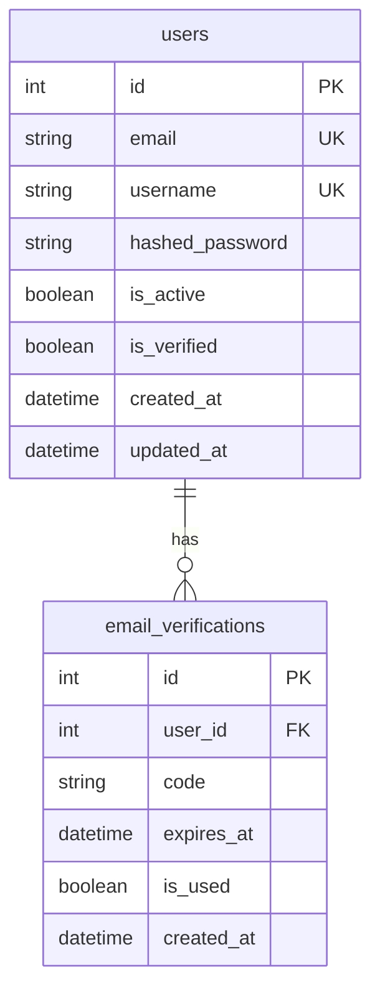
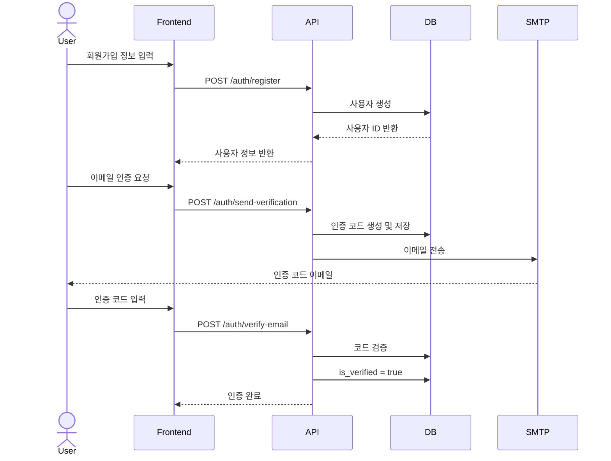
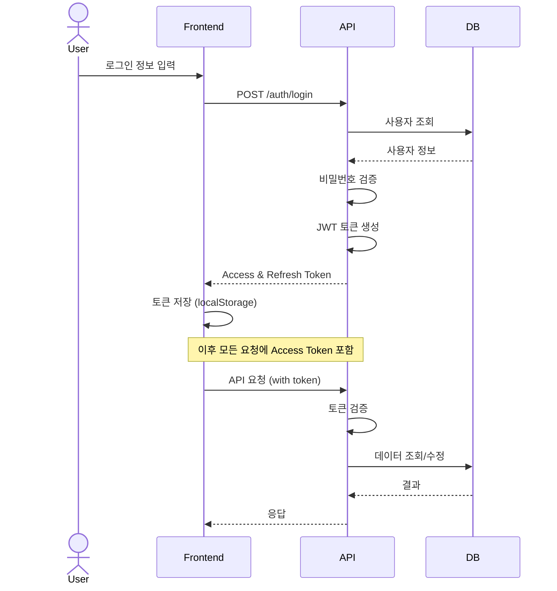
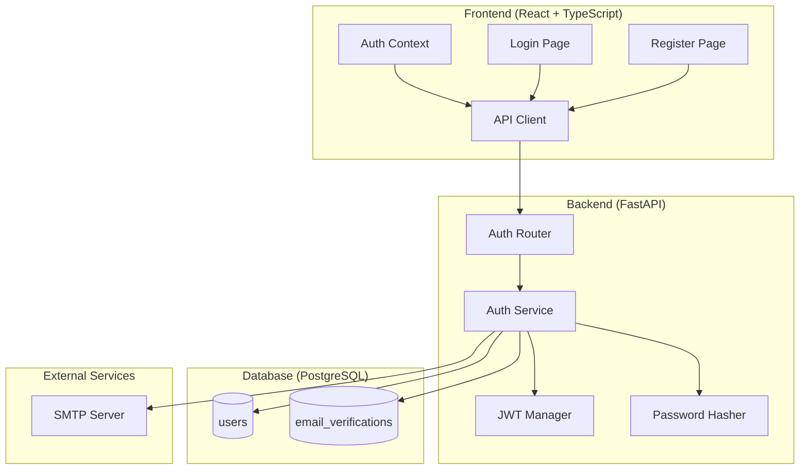

# v0.1 - 인증 시스템 (Authentication System)

## 📋 기능 개요

사용자 회원가입, 로그인, 이메일 인증 기능을 제공하는 인증 시스템

### 주요 기능
- 사용자 회원가입 (이메일/비밀번호)
- 이메일 인증 (6자리 코드)
- 로그인 (JWT 토큰 발급)
- 토큰 갱신 (Refresh Token)
- 사용자 정보 조회

---

## 🔌 API 엔드포인트

### 1. 회원가입
```http
POST /api/v1/auth/register
Content-Type: application/json

{
  "email": "user@example.com",
  "username": "username",
  "password": "password123"
}
```

**응답**
```json
{
  "id": 1,
  "email": "user@example.com",
  "username": "username",
  "is_active": false,
  "is_verified": false,
  "created_at": "2026-01-07T00:00:00Z"
}
```

### 2. 이메일 인증 코드 전송
```http
POST /api/v1/auth/send-verification
Content-Type: application/json

{
  "email": "user@example.com"
}
```

### 3. 이메일 인증
```http
POST /api/v1/auth/verify-email
Content-Type: application/json

{
  "email": "user@example.com",
  "code": "123456"
}
```

### 4. 로그인
```http
POST /api/v1/auth/login
Content-Type: application/x-www-form-urlencoded

username=user@example.com&password=password123
```

**응답**
```json
{
  "access_token": "eyJhbGciOiJIUzI1NiIs...",
  "refresh_token": "eyJhbGciOiJIUzI1NiIs...",
  "token_type": "bearer"
}
```

### 5. 토큰 갱신
```http
POST /api/v1/auth/refresh
Content-Type: application/json

{
  "refresh_token": "eyJhbGciOiJIUzI1NiIs..."
}
```

### 6. 현재 사용자 정보
```http
GET /api/v1/auth/me
Authorization: Bearer {access_token}
```

---

## 🗄️ 데이터베이스 스키마



### users 테이블
| 컬럼 | 타입 | 제약 | 설명 |
|------|------|------|------|
| id | Integer | PK | 사용자 ID |
| email | String(255) | UNIQUE, NOT NULL | 이메일 |
| username | String(50) | UNIQUE, NOT NULL | 사용자명 |
| hashed_password | String(255) | NOT NULL | 해시된 비밀번호 |
| is_active | Boolean | DEFAULT true | 활성화 여부 |
| is_verified | Boolean | DEFAULT false | 이메일 인증 여부 |
| created_at | DateTime | NOT NULL | 생성 시각 |
| updated_at | DateTime | NOT NULL | 수정 시각 |

### email_verifications 테이블
| 컬럼 | 타입 | 제약 | 설명 |
|------|------|------|------|
| id | Integer | PK | 인증 ID |
| user_id | Integer | FK(users.id) | 사용자 ID |
| code | String(6) | NOT NULL | 인증 코드 (6자리) |
| expires_at | DateTime | NOT NULL | 만료 시각 |
| is_used | Boolean | DEFAULT false | 사용 여부 |
| created_at | DateTime | NOT NULL | 생성 시각 |

---

## 🔄 시퀀스 다이어그램

### 회원가입 및 이메일 인증 플로우



### 로그인 플로우



---

## 🏗️ 아키텍처



---

## 🔐 보안 고려사항

### 1. 비밀번호 보안
- bcrypt 해싱 알고리즘 사용
- Salt 자동 생성
- 최소 길이 제한

### 2. JWT 토큰
- Access Token: 30분 유효
- Refresh Token: 7일 유효
- HS256 알고리즘 사용
- SECRET_KEY 환경변수로 관리

### 3. 이메일 인증
- 6자리 랜덤 코드
- 10분 유효 시간
- 일회용 (사용 시 is_used = true)

### 4. CORS 설정
- 허용된 origin만 접근 가능
- Credentials 허용

---

## 📁 파일 구조

```
backend/
├── app/
│   ├── api/
│   │   └── v1/
│   │       └── auth.py              # 인증 라우터
│   ├── models/
│   │   ├── user.py                  # User 모델
│   │   └── email_verification.py   # EmailVerification 모델
│   ├── schemas/
│   │   ├── user.py                  # User 스키마
│   │   └── auth.py                  # Auth 스키마
│   ├── services/
│   │   ├── auth_service.py          # 인증 서비스
│   │   └── email_service.py         # 이메일 서비스
│   └── core/
│       ├── security.py              # JWT, 비밀번호 해싱
│       └── config.py                # 설정
│
frontend/
├── src/
│   ├── pages/
│   │   ├── Register.tsx             # 회원가입 페이지
│   │   ├── Login.tsx                # 로그인 페이지
│   │   └── VerifyEmail.tsx          # 이메일 인증 페이지
│   ├── contexts/
│   │   └── AuthContext.tsx          # 인증 컨텍스트
│   └── services/
│       └── api.client.ts            # API 클라이언트
```

---

## 🛠️ 유지보수 가이드

### 코드 위치

#### 1. 사용자 모델 수정
- **파일**: `backend/app/models/user.py`
- **주의**: 스키마 변경 시 Alembic 마이그레이션 필요

#### 2. JWT 토큰 설정 변경
- **파일**: `backend/app/core/security.py`
- **설정**:
  - `ACCESS_TOKEN_EXPIRE_MINUTES`: Access Token 유효 시간
  - `REFRESH_TOKEN_EXPIRE_DAYS`: Refresh Token 유효 시간
  - `ALGORITHM`: 서명 알고리즘

#### 3. 이메일 템플릿 수정
- **파일**: `backend/app/services/email_service.py`
- **함수**: `send_verification_email()`

#### 4. 프론트엔드 인증 로직
- **파일**: `frontend/src/contexts/AuthContext.tsx`
- **주요 함수**:
  - `login()`: 로그인 처리
  - `logout()`: 로그아웃 처리
  - `refreshToken()`: 토큰 갱신

### 일반적인 문제 해결

#### 1. 이메일 전송 실패
```python
# backend/app/core/config.py
SMTP_HOST = "smtp.gmail.com"
SMTP_PORT = 587
SMTP_USER = "your-email@gmail.com"
SMTP_PASSWORD = "app-password"  # Gmail 앱 비밀번호 사용
```

#### 2. JWT 토큰 검증 실패
- SECRET_KEY 확인
- 토큰 만료 확인
- 토큰 형식 확인 (Bearer {token})

#### 3. CORS 에러
```python
# backend/app/main.py
app.add_middleware(
    CORSMiddleware,
    allow_origins=["http://localhost:5174"],  # 프론트엔드 URL
    allow_credentials=True,
    allow_methods=["*"],
    allow_headers=["*"],
)
```

### 테스트 방법

#### 1. 회원가입 테스트
```bash
curl -X POST http://localhost:8000/api/v1/auth/register \
  -H "Content-Type: application/json" \
  -d '{
    "email": "test@example.com",
    "username": "testuser",
    "password": "password123"
  }'
```

#### 2. 로그인 테스트
```bash
curl -X POST http://localhost:8000/api/v1/auth/login \
  -H "Content-Type: application/x-www-form-urlencoded" \
  -d "username=test@example.com&password=password123"
```

#### 3. 인증된 요청 테스트
```bash
curl -X GET http://localhost:8000/api/v1/auth/me \
  -H "Authorization: Bearer {access_token}"
```

---

## 📊 성능 최적화

### 1. 데이터베이스 인덱스
- `users.email`: UNIQUE 인덱스
- `users.username`: UNIQUE 인덱스
- `email_verifications.user_id`: 외래 키 인덱스

### 2. 비밀번호 해싱 비용
```python
# bcrypt rounds: 12 (기본값)
# 보안과 성능의 균형
pwd_context = CryptContext(schemes=["bcrypt"], deprecated="auto")
```

### 3. 토큰 검증 캐싱
- 현재 미구현
- 향후 Redis 캐싱 고려

---

## 🔄 업데이트 이력

| 버전 | 날짜 | 변경 내용 |
|------|------|-----------|
| v0.1 | 2026-01-07 | 초기 인증 시스템 구현 |
