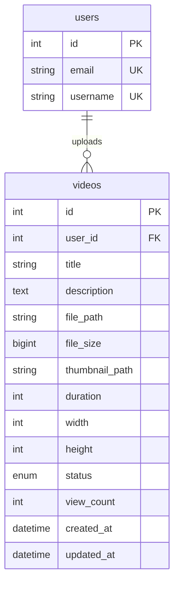
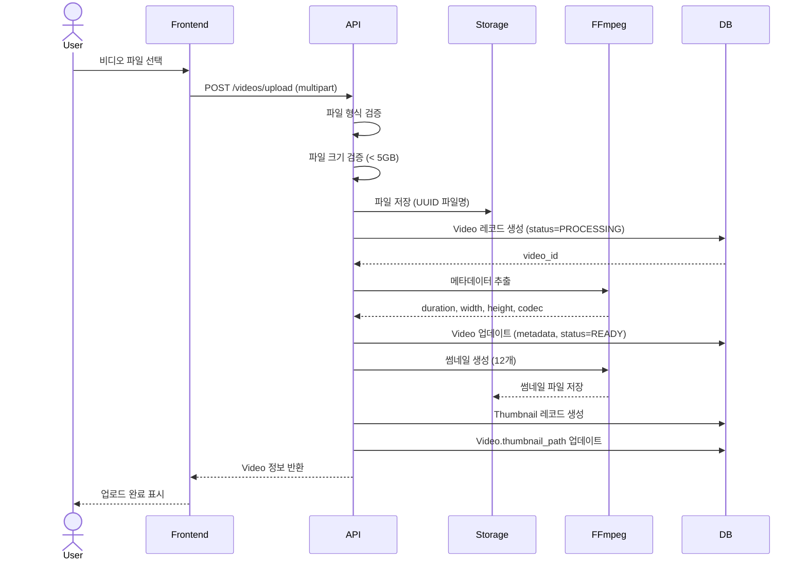
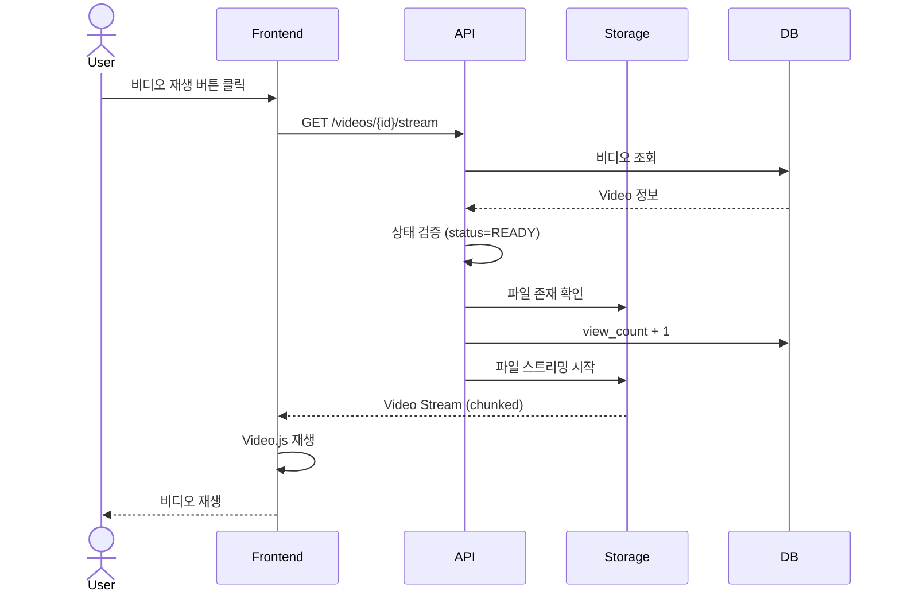
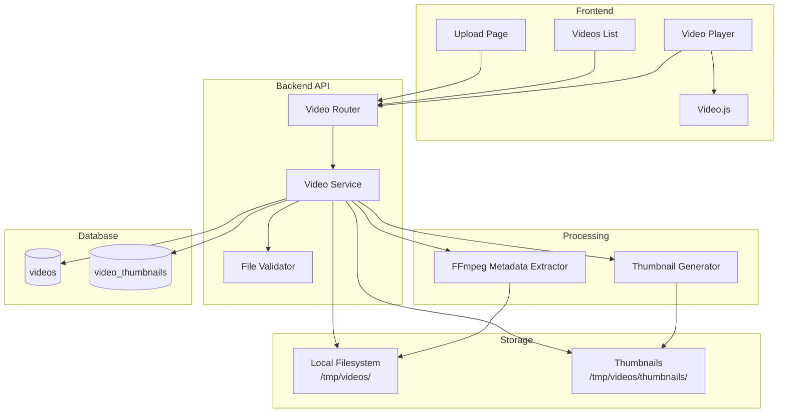

# v0.2 - 비디오 업로드 및 스트리밍 (Video Upload & Streaming)

## 📋 기능 개요

비디오 파일 업로드, 메타데이터 추출, 스트리밍 재생 기능을 제공하는 비디오 관리 시스템

### 주요 기능
- 비디오 파일 업로드 (최대 5GB)
- FFmpeg를 통한 메타데이터 자동 추출 (해상도, 길이, 코덱 등)
- 비디오 스트리밍 (HTTP Progressive Download)
- 비디오 목록 조회 (페이지네이션)
- 비디오 수정/삭제 (업로더만 가능)
- 조회수 카운팅

---

## 🔌 API 엔드포인트

### 1. 비디오 업로드
```http
POST /api/v1/videos/upload
Authorization: Bearer {access_token}
Content-Type: multipart/form-data

file: (binary)
title: "비디오 제목"
description: "비디오 설명" (optional)
```

**응답**
```json
{
  "id": 1,
  "title": "비디오 제목",
  "description": "비디오 설명",
  "file_path": "/tmp/videos/uuid.mp4",
  "file_size": 104857600,
  "thumbnail_path": "/tmp/videos/thumbnails/1/thumb_001.webp",
  "duration": 120,
  "width": 1920,
  "height": 1080,
  "status": "READY",
  "view_count": 0,
  "created_at": "2026-01-07T00:00:00Z",
  "user_id": 1
}
```

### 2. 비디오 목록 조회
```http
GET /api/v1/videos/?skip=0&limit=20
```

**응답**
```json
[
  {
    "id": 1,
    "title": "비디오 제목",
    "description": "비디오 설명",
    "file_size": 104857600,
    "thumbnail_path": "/tmp/videos/thumbnails/1/thumb_001.webp",
    "duration": 120,
    "width": 1920,
    "height": 1080,
    "status": "READY",
    "view_count": 0,
    "created_at": "2026-01-07T00:00:00Z",
    "uploader_username": "username"
  }
]
```

### 3. 비디오 상세 조회
```http
GET /api/v1/videos/{video_id}
```

### 4. 비디오 스트리밍
```http
GET /api/v1/videos/{video_id}/stream
```

**응답**: HTTP Streaming Response (video/mp4)

### 5. 내 비디오 목록
```http
GET /api/v1/videos/my-videos?skip=0&limit=20
Authorization: Bearer {access_token}
```

### 6. 비디오 수정
```http
PUT /api/v1/videos/{video_id}
Authorization: Bearer {access_token}
Content-Type: application/json

{
  "title": "새 제목",
  "description": "새 설명"
}
```

### 7. 비디오 삭제
```http
DELETE /api/v1/videos/{video_id}
Authorization: Bearer {access_token}
```

---

## 🗄️ 데이터베이스 스키마



### videos 테이블
| 컬럼 | 타입 | 제약 | 설명 |
|------|------|------|------|
| id | Integer | PK | 비디오 ID |
| user_id | Integer | FK(users.id), NOT NULL | 업로더 ID |
| title | String(255) | NOT NULL | 제목 |
| description | Text | NULL | 설명 |
| file_path | String(500) | NOT NULL | 파일 경로 |
| file_size | BigInteger | NULL | 파일 크기 (bytes) |
| thumbnail_path | String(500) | NULL | 썸네일 경로 |
| duration | Integer | NULL | 재생 시간 (초) |
| width | Integer | NULL | 가로 해상도 |
| height | Integer | NULL | 세로 해상도 |
| status | Enum | NOT NULL | 상태 (PROCESSING, READY, ERROR) |
| view_count | Integer | DEFAULT 0 | 조회수 |
| created_at | DateTime | NOT NULL | 생성 시각 |
| updated_at | DateTime | NOT NULL | 수정 시각 |

### VideoStatus Enum
```python
class VideoStatus(str, Enum):
    PROCESSING = "processing"  # 업로드 후 메타데이터 추출 중
    READY = "ready"           # 재생 가능
    ERROR = "error"           # 처리 실패
```

---

## 🔄 시퀀스 다이어그램

### 비디오 업로드 플로우



### 비디오 스트리밍 플로우



---

## 🏗️ 아키텍처



---

## 🎬 FFmpeg 메타데이터 추출

### 사용하는 명령어

```bash
# 비디오 메타데이터 추출
ffprobe -v error \
  -show_entries format=duration:stream=width,height,codec_name \
  -of json \
  video.mp4
```

### 추출하는 정보
- `duration`: 재생 시간 (초)
- `width`: 가로 해상도
- `height`: 세로 해상도
- `codec_name`: 비디오 코덱

### 코드 위치
- **파일**: `backend/app/services/video_service.py`
- **함수**: `update_video_metadata()`

---

## 📁 파일 구조

```
backend/
├── app/
│   ├── api/
│   │   └── v1/
│   │       └── videos.py                # 비디오 라우터
│   ├── models/
│   │   └── video.py                     # Video 모델
│   ├── schemas/
│   │   └── video.py                     # Video 스키마
│   ├── services/
│   │   └── video_service.py             # 비디오 서비스
│   └── core/
│       └── config.py                    # 설정 (업로드 경로 등)
│
frontend/
├── src/
│   ├── pages/
│   │   ├── Upload.tsx                   # 업로드 페이지
│   │   ├── Videos.tsx                   # 비디오 목록
│   │   └── VideoDetail.tsx              # 비디오 상세
│   └── components/
│       └── video/
│           └── VideoPlayer.tsx          # Video.js 플레이어
│
/tmp/videos/                              # 비디오 저장소
├── {uuid}.mp4
├── {uuid}.mkv
└── thumbnails/
    └── {video_id}/
        ├── thumb_001.webp
        └── ...
```

---

## 🛠️ 유지보수 가이드

### 설정 변경

#### 1. 업로드 파일 크기 제한
```python
# backend/app/core/config.py
MAX_UPLOAD_SIZE = 5 * 1024 * 1024 * 1024  # 5GB
```

#### 2. 허용 파일 형식
```python
# backend/app/core/config.py
ALLOWED_VIDEO_EXTENSIONS = ".mp4,.mkv,.avi,.mov,.webm"
```

#### 3. 업로드 디렉토리
```python
# backend/app/core/config.py
UPLOAD_DIR = "/tmp/videos"
```

### 문제 해결

#### 1. FFmpeg 메타데이터 추출 실패
- FFmpeg 설치 확인: `ffmpeg -version`
- FFprobe 설치 확인: `ffprobe -version`
- 파일 권한 확인
- 파일 형식 호환성 확인

**로그 확인**:
```python
# backend/app/services/video_service.py
print(f"FFmpeg error: {result.stderr}")
```

#### 2. 비디오 스트리밍 재생 안됨
- 비디오 상태 확인 (status=READY)
- 파일 존재 확인
- CORS 설정 확인
- 브라우저 코덱 지원 확인

#### 3. 대용량 파일 업로드 실패
- Nginx/웹서버 업로드 크기 제한 확인
- 타임아웃 설정 확인
- 디스크 공간 확인

### 성능 최적화

#### 1. 비디오 스트리밍
**현재**: Progressive Download
**개선 방안**:
- HLS/DASH 적용 (향후)
- Range Request 지원 (Seek 기능)

#### 2. 썸네일 생성
- 비동기 처리 (Celery 도입 고려)
- 현재는 업로드 시 동기적으로 생성

#### 3. 파일 저장소
**현재**: Local Filesystem
**개선 방안**:
- S3/Object Storage 도입
- CDN 연동

### 데이터베이스 최적화

#### 인덱스
```sql
-- 사용자별 비디오 조회 최적화
CREATE INDEX idx_videos_user_id ON videos(user_id);

-- 상태별 비디오 조회 최적화
CREATE INDEX idx_videos_status ON videos(status);

-- 생성일 기준 정렬 최적화
CREATE INDEX idx_videos_created_at ON videos(created_at DESC);
```

---

## 🔒 보안 고려사항

### 1. 파일 업로드 검증
- 파일 확장자 검증
- MIME 타입 검증
- 파일 크기 제한 (5GB)
- 파일명 UUID 변환 (경로 탐색 공격 방지)

### 2. 권한 검증
- 비디오 수정/삭제: 업로더만 가능
- JWT 토큰 검증

### 3. 파일 시스템 보안
- 업로드 디렉토리 외부 접근 차단
- 실행 권한 제거

---

## 📊 지원하는 비디오 형식

| 형식 | 확장자 | 코덱 | 브라우저 지원 |
|------|--------|------|--------------|
| MP4 | .mp4 | H.264, H.265 | ✅ 전체 |
| WebM | .webm | VP8, VP9, AV1 | ✅ 전체 |
| MKV | .mkv | 다양 | ⚠️ 변환 필요 |
| AVI | .avi | 다양 | ⚠️ 변환 필요 |
| MOV | .mov | 다양 | ⚠️ Safari만 |

**권장**: MP4 (H.264) - 최상의 호환성

---

## 🔄 업데이트 이력

| 버전 | 날짜 | 변경 내용 |
|------|------|-----------|
| v0.2 | 2026-01-07 | 비디오 업로드 및 스트리밍 시스템 구현 |
