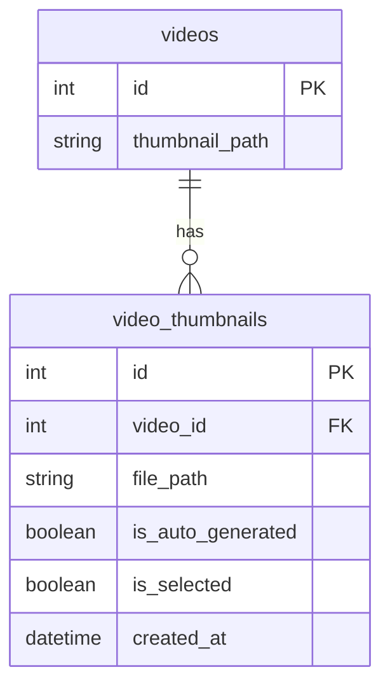
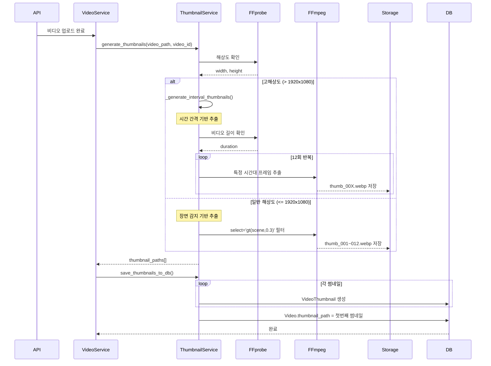
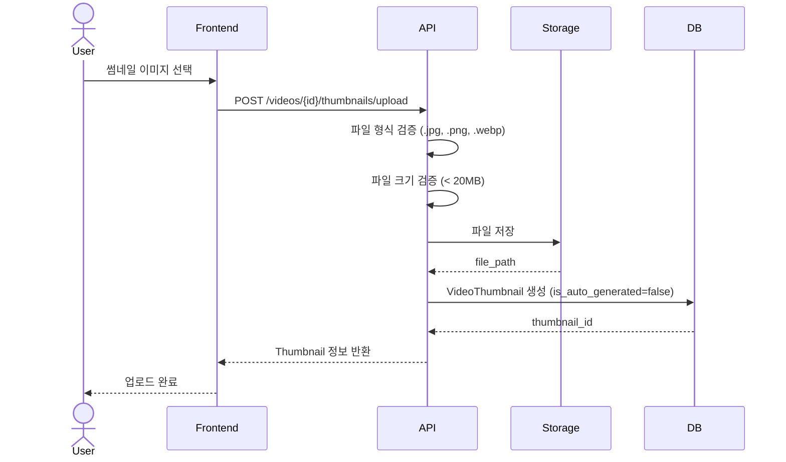
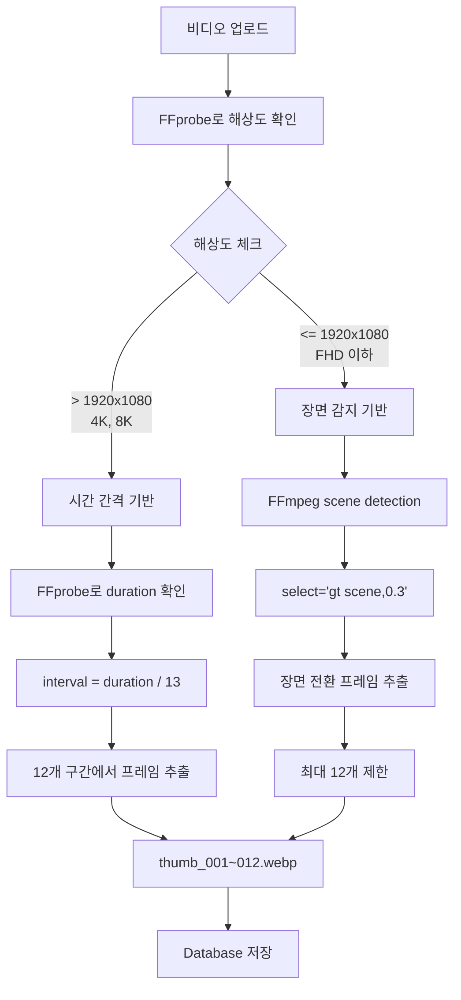

# v0.3 - 썸네일 자동 생성 시스템 (Thumbnail Generation System)

## 📋 기능 개요

비디오 업로드 시 FFmpeg를 사용하여 썸네일을 자동으로 생성하고 관리하는 시스템

### 주요 기능
- 자동 썸네일 생성 (최대 12개)
- 장면 감지 기반 썸네일 추출 (1080p 이하)
- 시간 간격 기반 썸네일 추출 (4K 이상)
- 커스텀 썸네일 업로드 (최대 20MB)
- 썸네일 선택 기능
- WebP 형식으로 최적화

---

## 🔌 API 엔드포인트

### 1. 비디오 썸네일 목록 조회
```http
GET /api/v1/videos/{video_id}/thumbnails
```

**응답**
```json
[
  {
    "id": 1,
    "video_id": 1,
    "file_path": "/tmp/videos/thumbnails/1/thumb_001.webp",
    "is_auto_generated": true,
    "is_selected": true,
    "created_at": "2026-01-07T00:00:00Z"
  },
  {
    "id": 2,
    "video_id": 1,
    "file_path": "/tmp/videos/thumbnails/1/thumb_002.webp",
    "is_auto_generated": true,
    "is_selected": false,
    "created_at": "2026-01-07T00:00:00Z"
  }
]
```

### 2. 썸네일 이미지 가져오기
```http
GET /api/v1/videos/{video_id}/thumbnails/{thumbnail_id}/image
```

**응답**: Image File (image/webp)

### 3. 선택된 썸네일 가져오기
```http
GET /api/v1/videos/{video_id}/thumbnail
```

**응답**: Image File (image/webp)

### 4. 썸네일 선택
```http
POST /api/v1/videos/{video_id}/thumbnails/select
Authorization: Bearer {access_token}
Content-Type: application/json

{
  "thumbnail_id": 2
}
```

### 5. 커스텀 썸네일 업로드
```http
POST /api/v1/videos/{video_id}/thumbnails/upload
Authorization: Bearer {access_token}
Content-Type: multipart/form-data

file: (binary)
```

**제약 조건**:
- 최대 크기: 20MB
- 허용 형식: .jpg, .jpeg, .png, .webp

---

## 🗄️ 데이터베이스 스키마



### video_thumbnails 테이블
| 컬럼 | 타입 | 제약 | 설명 |
|------|------|------|------|
| id | Integer | PK | 썸네일 ID |
| video_id | Integer | FK(videos.id), NOT NULL | 비디오 ID |
| file_path | String(500) | NOT NULL | 파일 경로 |
| is_auto_generated | Boolean | DEFAULT true | 자동 생성 여부 |
| is_selected | Boolean | DEFAULT false | 선택된 썸네일 여부 |
| created_at | DateTime | NOT NULL | 생성 시각 |

---

## 🔄 시퀀스 다이어그램

### 자동 썸네일 생성 플로우



### 커스텀 썸네일 업로드 플로우



---

## 🏗️ FFmpeg 썸네일 생성 알고리즘

### 1. 해상도 기반 방식 선택



### 2. 장면 감지 기반 (1080p 이하)

**FFmpeg 명령어**:
```bash
ffmpeg -i input.mp4 \
  -vf "select='gt(scene,0.3)',scale=1280:720,setpts=N/FRAME_RATE/TB" \
  -frames:v 12 \
  -c:v libwebp \
  -q:v 2 \
  -f image2 \
  /tmp/videos/thumbnails/1/thumb_%03d.webp
```

**설명**:
- `select='gt(scene,0.3)'`: 장면 전환 감지 (임계값 0.3)
- `scale=1280:720`: 720p로 리사이즈
- `setpts=N/FRAME_RATE/TB`: 프레임 타임스탬프 재설정
- `-frames:v 12`: 최대 12개 프레임
- `-c:v libwebp`: WebP 인코더 (단일 이미지)
- `-q:v 2`: 품질 2 (1-31, 낮을수록 고품질)

**장점**: 의미있는 장면 전환에서 썸네일 추출
**단점**: 고해상도 비디오에서 매우 느림 (0.0004x 속도)

### 3. 시간 간격 기반 (4K 이상)

**알고리즘**:
```python
duration = get_video_duration(video_path)  # 141초
interval = duration / 13                    # 10.8초

for i in range(1, 13):
    timestamp = interval * i                # 10.8, 21.6, 32.4, ...
    extract_frame_at(timestamp)
```

**FFmpeg 명령어** (각 썸네일마다):
```bash
ffmpeg -ss {timestamp} \
  -i input.mp4 \
  -vframes 1 \
  -vf scale=1280:720 \
  -c:v libwebp \
  -q:v 2 \
  /tmp/videos/thumbnails/1/thumb_001.webp
```

**설명**:
- `-ss {timestamp}`: 특정 시간대로 시크
- `-vframes 1`: 1개 프레임만 추출
- 각 썸네일을 개별적으로 생성 (빠름)

**장점**: 빠른 처리 속도
**단점**: 의미없는 장면이 선택될 수 있음

---

## 📁 파일 구조

```
backend/
├── app/
│   ├── api/
│   │   └── v1/
│   │       └── videos.py                # 썸네일 엔드포인트
│   ├── models/
│   │   └── video_thumbnail.py           # VideoThumbnail 모델
│   ├── schemas/
│   │   └── thumbnail.py                 # Thumbnail 스키마
│   └── services/
│       └── thumbnail_service.py         # 썸네일 생성 로직
│
/tmp/videos/thumbnails/
└── {video_id}/
    ├── thumb_001.webp
    ├── thumb_002.webp
    └── ...
    └── custom_uuid.webp                  # 커스텀 썸네일
```

---

## 🛠️ 유지보수 가이드

### 설정 변경

#### 1. 썸네일 개수 변경
```python
# backend/app/api/v1/videos.py (upload 함수)
thumbnail_paths = thumbnail_service.generate_thumbnails(
    str(file_path),
    video.id,
    max_thumbnails=12  # 여기 수정
)
```

#### 2. 썸네일 해상도 변경
```python
# backend/app/services/thumbnail_service.py
# scale=1280:720 -> scale=640:360 (360p)
'-vf', 'scale=640:360',
```

#### 3. 장면 감지 임계값 변경
```python
# backend/app/services/thumbnail_service.py
# select='gt(scene,0.3)' -> select='gt(scene,0.5)' (더 큰 변화만 감지)
'-vf', f"select='gt(scene,0.5)',scale=1280:720,setpts=N/FRAME_RATE/TB",
```

#### 4. 고해상도 기준 변경
```python
# backend/app/services/thumbnail_service.py
if width > 1920 or height > 1080:  # 1920 -> 3840 (4K 이상만)
```

### 문제 해결

#### 1. 썸네일이 1개만 생성됨
**원인**: 장면 감지가 고해상도에서 타임아웃
**해결**: 자동으로 간격 기반으로 전환됨 (v0.3 업데이트)

**확인**:
```bash
# 로그에서 확인
High resolution video (3840x2160), using interval-based thumbnails
```

#### 2. 썸네일 생성 실패
**원인**: FFmpeg 오류
**확인**:
```python
# backend/app/services/thumbnail_service.py
print(f"FFmpeg error: {result.stderr}")
```

**해결**:
- FFmpeg 설치 확인
- 파일 권한 확인
- 디스크 공간 확인

#### 3. 썸네일 품질이 낮음
```python
# backend/app/services/thumbnail_service.py
'-q:v', '2',  # 2 -> 1 (최고 품질)
```

### 성능 최적화

#### 1. 썸네일 생성 시간

| 해상도 | 방식 | 시간 |
|--------|------|------|
| 1080p | 장면 감지 | ~10초 |
| 1080p | 간격 기반 | ~5초 |
| 4K | 장면 감지 | 120초+ (타임아웃) |
| 4K | 간격 기반 | ~15초 |

**권장**: 4K 이상은 간격 기반 (자동 적용)

#### 2. 비동기 처리
**현재**: 업로드 시 동기적으로 생성
**개선안**: Celery로 백그라운드 처리

```python
# 향후 개선안
@celery_app.task
def generate_thumbnails_async(video_id):
    # 비동기로 썸네일 생성
    pass
```

---

## 🖼️ 썸네일 형식 비교

| 형식 | 크기 | 품질 | 브라우저 지원 |
|------|------|------|--------------|
| WebP | 10-20KB | 높음 | ✅ 전체 |
| JPEG | 30-50KB | 중간 | ✅ 전체 |
| PNG | 100-200KB | 높음 | ✅ 전체 |

**선택**: WebP - 최고의 압축률과 품질

---

## 📊 코드 위치

### 주요 함수

#### 1. 썸네일 생성
- **파일**: `backend/app/services/thumbnail_service.py`
- **함수**: `generate_thumbnails()`
- **라인**: 16-102

#### 2. 간격 기반 생성
- **파일**: `backend/app/services/thumbnail_service.py`
- **함수**: `_generate_interval_thumbnails()`
- **라인**: 104-138

#### 3. DB 저장
- **파일**: `backend/app/services/thumbnail_service.py`
- **함수**: `save_thumbnails_to_db()`
- **라인**: 140-171

#### 4. 썸네일 선택
- **파일**: `backend/app/services/thumbnail_service.py`
- **함수**: `select_thumbnail()`
- **라인**: 173-209

---

## 🔒 보안 고려사항

### 1. 커스텀 썸네일 업로드
- 파일 크기 제한: 20MB
- 파일 형식 검증: .jpg, .jpeg, .png, .webp
- 파일명 UUID 변환
- 업로더 권한 검증

### 2. 파일 접근
- 썸네일은 인증 없이 접근 가능 (공개)
- 파일 경로 직접 노출 방지 (ID로 접근)

---

## 🔄 업데이트 이력

| 버전 | 날짜 | 변경 내용 |
|------|------|-----------|
| v0.3.0 | 2026-01-07 | 썸네일 자동 생성 시스템 구현 |
| v0.3.1 | 2026-01-07 | 4K 비디오 대응 (간격 기반 추출) |
| v0.3.2 | 2026-01-07 | 커스텀 썸네일 업로드 기능 (20MB 제한) |
