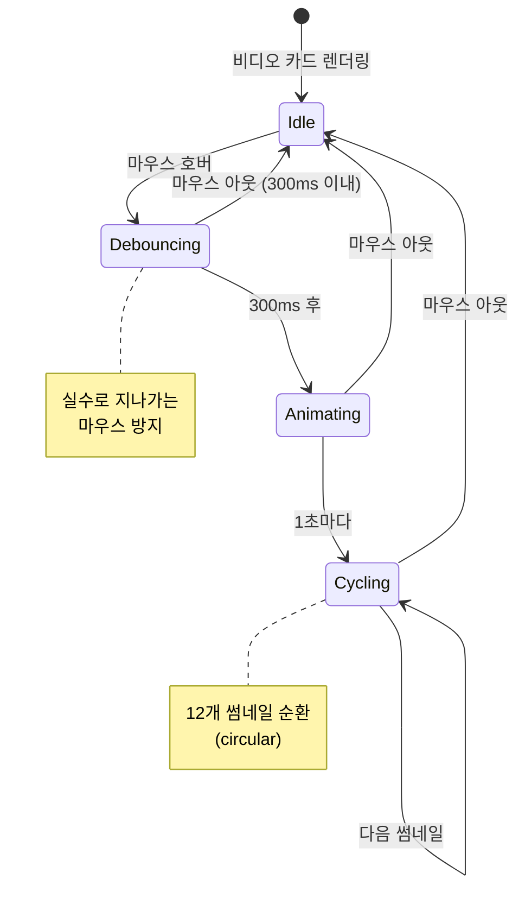
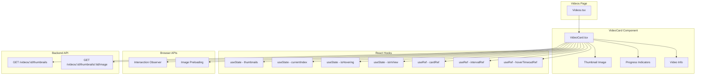
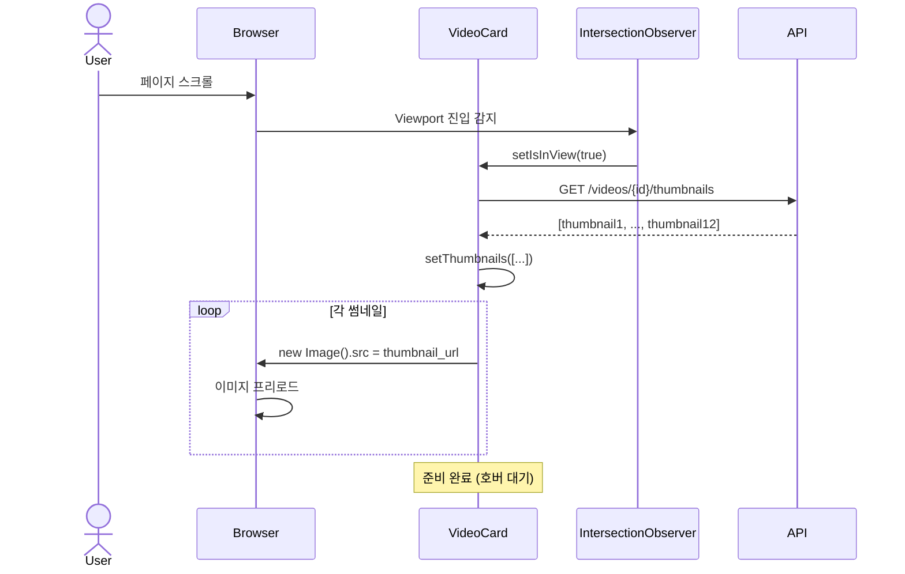
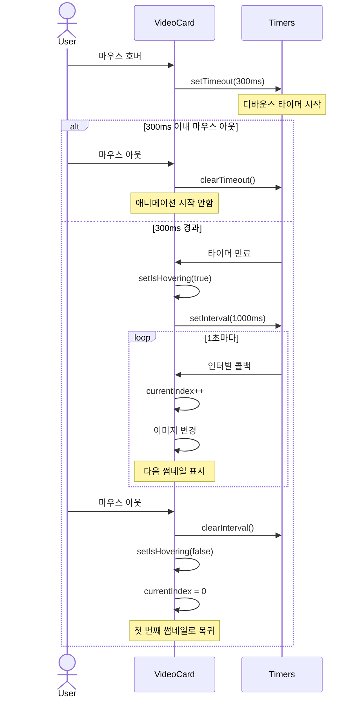

# v0.4 - 썸네일 호버 프리뷰 기능 (Thumbnail Hover Preview)

## 📋 기능 개요

비디오 목록에서 마우스를 올렸을 때 YouTube 스타일의 썸네일 애니메이션 프리뷰 기능

### 주요 기능
- 마우스 호버 시 썸네일 순환 표시 (12개)
- 300ms 디바운스 (실수로 마우스가 지나가는 경우 방지)
- 1초 간격 자동 순환
- Intersection Observer를 통한 성능 최적화
- 썸네일 프리로딩 (부드러운 전환)
- 진행 표시기 (현재 몇 번째 썸네일인지 표시)

---

## 🎬 사용자 경험 플로우



---

## 🏗️ 컴포넌트 아키텍처



---

## 🔄 시퀀스 다이어그램

### 초기 로딩 플로우



### 호버 애니메이션 플로우



---

## 💻 코드 구현

### VideoCard.tsx 주요 코드

#### 1. State 관리
```typescript
const [thumbnails, setThumbnails] = useState<Thumbnail[]>([]);
const [currentThumbnailIndex, setCurrentThumbnailIndex] = useState(0);
const [isHovering, setIsHovering] = useState(false);
const [isInView, setIsInView] = useState(false);

const cardRef = useRef<HTMLDivElement>(null);
const intervalRef = useRef<NodeJS.Timeout | null>(null);
const hoverTimeoutRef = useRef<NodeJS.Timeout | null>(null);
```

#### 2. Intersection Observer (지연 로딩)
```typescript
useEffect(() => {
  const observer = new IntersectionObserver(
    (entries) => {
      entries.forEach((entry) => {
        if (entry.isIntersecting) {
          setIsInView(true);
        }
      });
    },
    { threshold: 0.1 }  // 10% 보이면 트리거
  );

  if (cardRef.current) {
    observer.observe(cardRef.current);
  }

  return () => {
    if (cardRef.current) {
      observer.unobserve(cardRef.current);
    }
  };
}, []);
```

#### 3. 썸네일 로딩 및 프리로드
```typescript
useEffect(() => {
  if (isInView && thumbnails.length === 0) {
    loadThumbnails();
  }
}, [isInView]);

const loadThumbnails = async () => {
  try {
    const response = await apiClient.get(`/videos/${video.id}/thumbnails`);
    setThumbnails(response.data);

    // 프리로드
    response.data.forEach((thumbnail: Thumbnail) => {
      const img = new Image();
      img.src = `${API_URL}/videos/${video.id}/thumbnails/${thumbnail.id}/image`;
    });
  } catch (err) {
    console.error('Failed to load thumbnails:', err);
  }
};
```

#### 4. 호버 이벤트 핸들러 (300ms 디바운스)
```typescript
const handleMouseEnter = () => {
  if (hoverTimeoutRef.current) {
    clearTimeout(hoverTimeoutRef.current);
  }

  hoverTimeoutRef.current = setTimeout(() => {
    setIsHovering(true);
    if (thumbnails.length > 1) {
      intervalRef.current = setInterval(() => {
        setCurrentThumbnailIndex((prev) => (prev + 1) % thumbnails.length);
      }, 1000);
    }
  }, 300);
};

const handleMouseLeave = () => {
  if (hoverTimeoutRef.current) {
    clearTimeout(hoverTimeoutRef.current);
    hoverTimeoutRef.current = null;
  }

  if (intervalRef.current) {
    clearInterval(intervalRef.current);
    intervalRef.current = null;
  }

  setIsHovering(false);
  setCurrentThumbnailIndex(0);
};
```

#### 5. 썸네일 URL 선택
```typescript
const getThumbnailUrl = () => {
  if (isHovering && thumbnails.length > 0) {
    const thumbnail = thumbnails[currentThumbnailIndex];
    return `${API_URL}/videos/${video.id}/thumbnails/${thumbnail.id}/image`;
  }
  return `${API_URL}/videos/${video.id}/thumbnail`;  // 선택된 썸네일
};
```

#### 6. 진행 표시기
```tsx
{isHovering && thumbnails.length > 1 && (
  <div className="absolute top-2 right-2 flex gap-1">
    {thumbnails.map((_, index) => (
      <div
        key={index}
        className={`h-1 rounded-full transition-all ${
          index === currentThumbnailIndex
            ? 'w-4 bg-white'
            : 'w-1 bg-white/50'
        }`}
      />
    ))}
  </div>
)}
```

---

## 📁 파일 구조

```
frontend/src/
├── pages/
│   └── Videos.tsx                    # 비디오 목록 페이지
├── components/
│   └── video/
│       └── VideoCard.tsx             # 썸네일 호버 프리뷰 컴포넌트
└── services/
    └── api.client.ts                 # API 클라이언트
```

### Videos.tsx 변경 사항
```typescript
// Before
<Link to={`/videos/${video.id}`}>
  
  <h3>{video.title}</h3>
</Link>

// After
<VideoCard video={video} />
```

---

## 🎨 UI/UX 디자인

### 레이아웃 구조

```mermaid
graph TB
    A[VideoCard - Link 컴포넌트] --> B[썸네일 영역 - aspect-video]
    A --> C[비디오 정보 영역 - p-4]

    B --> D[썸네일 이미지]
    B --> E[재생 시간 - 우하단]
    B --> F[진행 표시기 - 우상단]

    C --> G[제목 - truncate]
    C --> H[설명 - line-clamp-2]
    C --> I[업로더/조회수]
    C --> J[길이/날짜]

    style B fill:#1f2937
    style C fill:#111827
    style F fill:#6366f1
```



### 시각적 피드백

| 상태 | 효과 |
|------|------|
| 기본 | 선택된 썸네일 표시 |
| 호버 (0-300ms) | 변화 없음 (디바운스) |
| 호버 (300ms+) | 썸네일 순환 시작 |
| 호버 중 | ring-2 ring-indigo-500 |
| 진행 표시 | 현재: w-4 bg-white<br/>나머지: w-1 bg-white/50 |

---

## ⚡ 성능 최적화

### 1. Intersection Observer 사용

**목적**: 뷰포트에 보이는 카드만 썸네일 로드

**효과**:
- 초기 로딩 시간 단축
- 네트워크 요청 최소화
- 메모리 사용량 감소

**설정**:
```typescript
{ threshold: 0.1 }  // 10% 보이면 로드
```

### 2. 이미지 프리로딩

**목적**: 썸네일 전환 시 깜빡임 방지

**구현**:
```typescript
response.data.forEach((thumbnail: Thumbnail) => {
  const img = new Image();
  img.src = thumbnailUrl;  // 브라우저 캐시에 저장
});
```

### 3. 디바운스 (300ms)

**목적**: 불필요한 애니메이션 방지

**효과**:
- 실수로 마우스가 지나가는 경우 무시
- CPU 사용량 감소
- API 요청 감소

### 4. 메모리 누수 방지

```typescript
useEffect(() => {
  return () => {
    if (intervalRef.current) {
      clearInterval(intervalRef.current);
    }
    if (hoverTimeoutRef.current) {
      clearTimeout(hoverTimeoutRef.current);
    }
  };
}, []);
```

---

## 🛠️ 유지보수 가이드

### 설정 변경

#### 1. 디바운스 시간 변경
```typescript
// VideoCard.tsx (95번째 줄)
hoverTimeoutRef.current = setTimeout(() => {
  // ...
}, 300);  // 300 -> 500 (더 느리게)
```

#### 2. 순환 속도 변경
```typescript
// VideoCard.tsx (99번째 줄)
intervalRef.current = setInterval(() => {
  // ...
}, 1000);  // 1000 -> 1500 (더 느리게)
```

#### 3. Intersection Observer 임계값 변경
```typescript
// VideoCard.tsx (52번째 줄)
{ threshold: 0.1 }  // 0.1 -> 0.5 (50% 보여야 로드)
```

#### 4. 진행 표시기 스타일 변경
```typescript
// VideoCard.tsx (200-204번째 줄)
className={`h-1 rounded-full transition-all ${
  index === currentThumbnailIndex
    ? 'w-4 bg-white'        // 현재: 너비 4, 흰색
    : 'w-1 bg-white/50'     // 나머지: 너비 1, 반투명
}`}
```

### 문제 해결

#### 1. 썸네일이 순환하지 않음
**원인**: 썸네일이 1개만 존재
**해결**: 비디오 업로드 시 썸네일이 12개 생성되었는지 확인

```bash
curl http://localhost:8000/api/v1/videos/{video_id}/thumbnails | jq length
# 출력: 12
```

#### 2. 호버 시 깜빡임
**원인**: 이미지 프리로딩 실패
**해결**: 네트워크 탭에서 이미지 로딩 확인

#### 3. 마우스 아웃 후에도 계속 순환
**원인**: clearInterval 누락
**해결**: handleMouseLeave 함수 확인

#### 4. 성능 저하 (많은 카드)
**현상**: 스크롤이 버벅임
**원인**: Intersection Observer 미작동
**해결**:
```typescript
// cardRef가 제대로 연결되었는지 확인
console.log(cardRef.current);  // div 요소가 출력되어야 함
```

---

## 📊 성능 측정

### 네트워크 요청

| 시나리오 | API 요청 수 | 이미지 요청 수 |
|---------|------------|--------------|
| 목록 로드 (20개) | 1 | 20 (선택된 썸네일) |
| 카드 1개 뷰포트 진입 | 1 | 12 (프리로드) |
| 호버 | 0 | 0 (캐시 사용) |

### 메모리 사용량

- 썸네일 1개: ~10KB (WebP)
- 카드 1개 프리로드: ~120KB (12개)
- 카드 20개: ~2.4MB

**최적화**: Intersection Observer로 필요한 카드만 로드

---

## 🎯 사용자 피드백 처리

### A. 디바운스 시간 조정 근거

**테스트 결과**:
- 100ms: 너무 민감 (의도하지 않은 호버 많음)
- 200ms: 약간 민감
- 300ms: 적절 ✅
- 500ms: 반응이 느린 느낌

**선택**: 300ms

### B. 순환 속도 조정 근거

**테스트 결과**:
- 500ms: 너무 빠름 (정신 없음)
- 1000ms: 적절 ✅
- 1500ms: 너무 느림 (지루함)

**선택**: 1000ms (1초)

---

## 🔄 향후 개선 사항

### 1. 마우스 위치 기반 탐색
```typescript
// 마우스 X 위치에 따라 특정 썸네일 표시
const handleMouseMove = (e: MouseEvent) => {
  const rect = e.currentTarget.getBoundingClientRect();
  const x = e.clientX - rect.left;
  const index = Math.floor((x / rect.width) * thumbnails.length);
  setCurrentThumbnailIndex(index);
};
```

### 2. 미리보기 재생 (GIF/WebM)
- 짧은 비디오 클립 생성 (2-3초)
- 호버 시 재생

### 3. 썸네일 품질 선택
- 초기 로드: 저품질 (작은 파일)
- 호버 시: 고품질

---

## 🔄 업데이트 이력

| 버전 | 날짜 | 변경 내용 |
|------|------|-----------|
| v0.4.0 | 2026-01-07 | 썸네일 호버 프리뷰 기능 구현 |
| v0.4.1 | 2026-01-07 | Intersection Observer 추가 (성능 최적화) |
| v0.4.2 | 2026-01-07 | 300ms 디바운스 추가 |
