# 전체 시스템 플로우 다이어그램

## 📋 목차
1. [사용자 여정 플로우](#사용자-여정-플로우)
2. [데이터 흐름도](#데이터-흐름도)
3. [시스템 상태 다이어그램](#시스템-상태-다이어그램)
4. [컴포넌트 관계도](#컴포넌트-관계도)
5. [배포 아키텍처](#배포-아키텍처)

---

## 사용자 여정 플로우

### 전체 사용자 여정

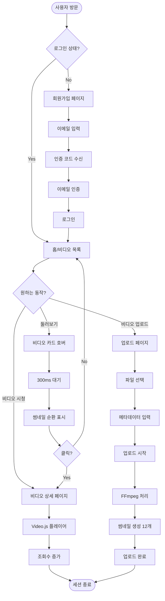

---

## 데이터 흐름도

### 비디오 업로드 및 재생 데이터 흐름

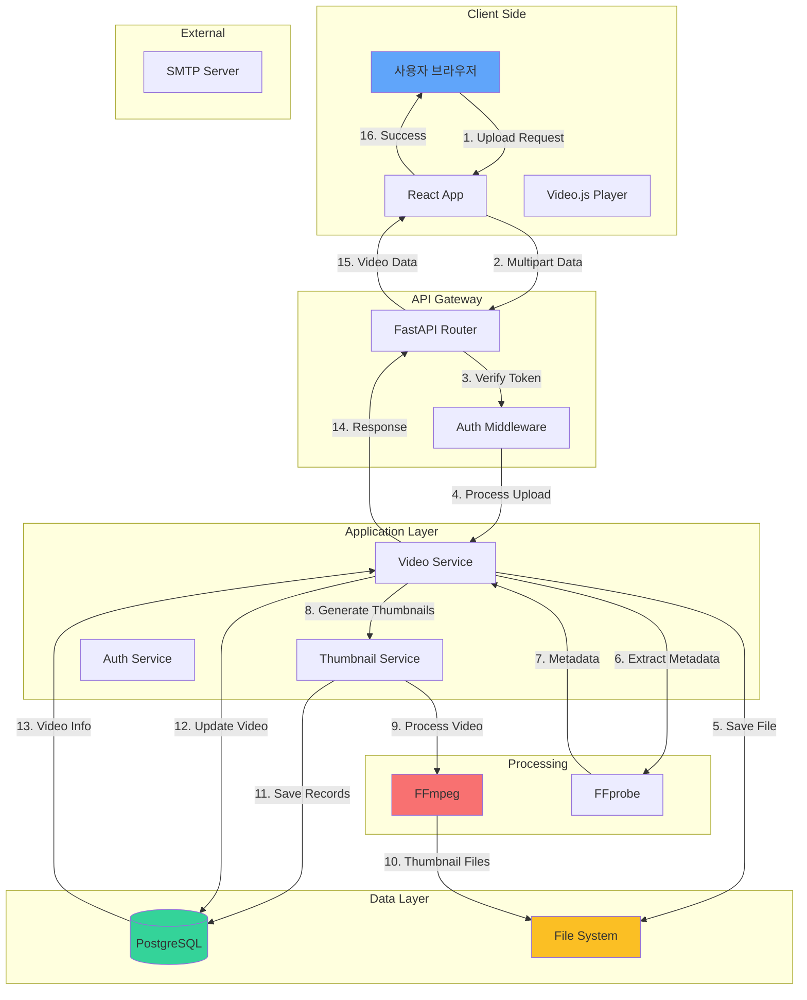

### 인증 데이터 흐름

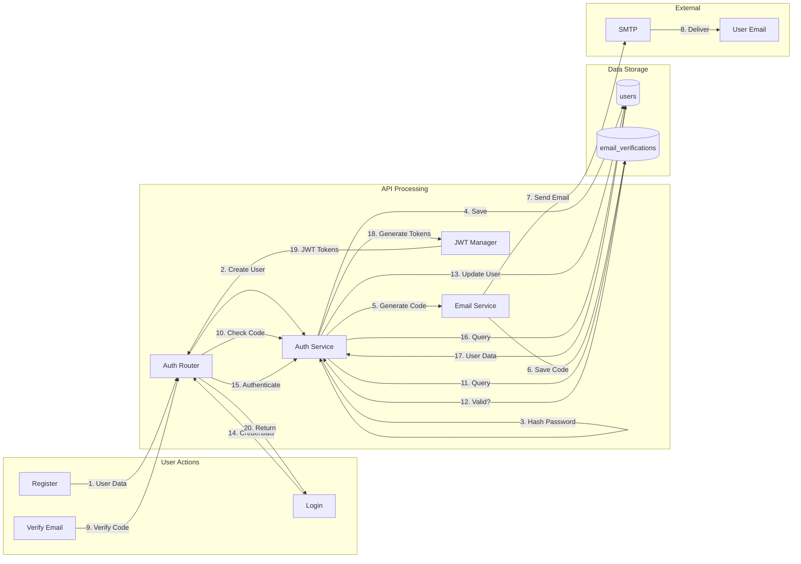

---

## 시스템 상태 다이어그램

### 비디오 상태 전이

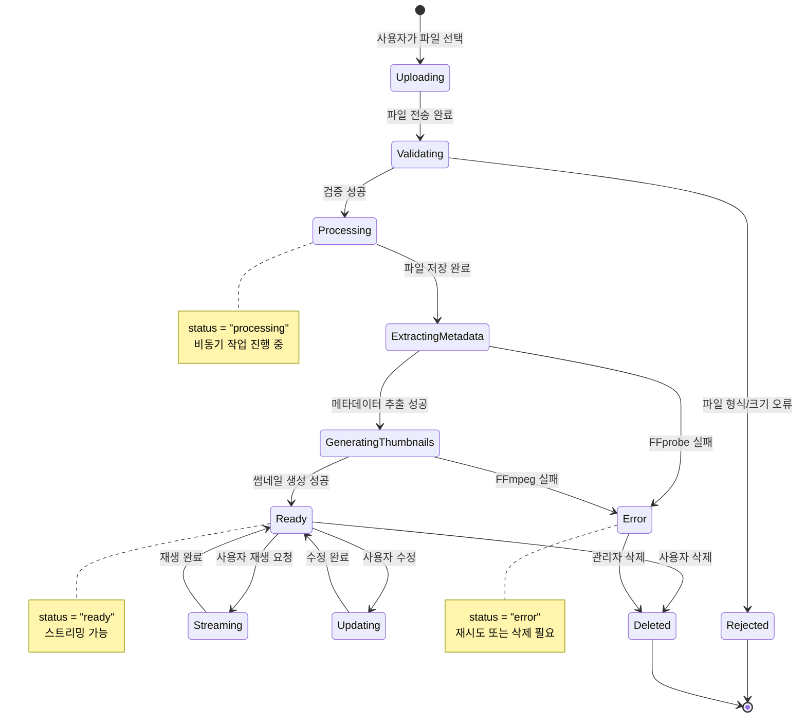

### 사용자 인증 상태

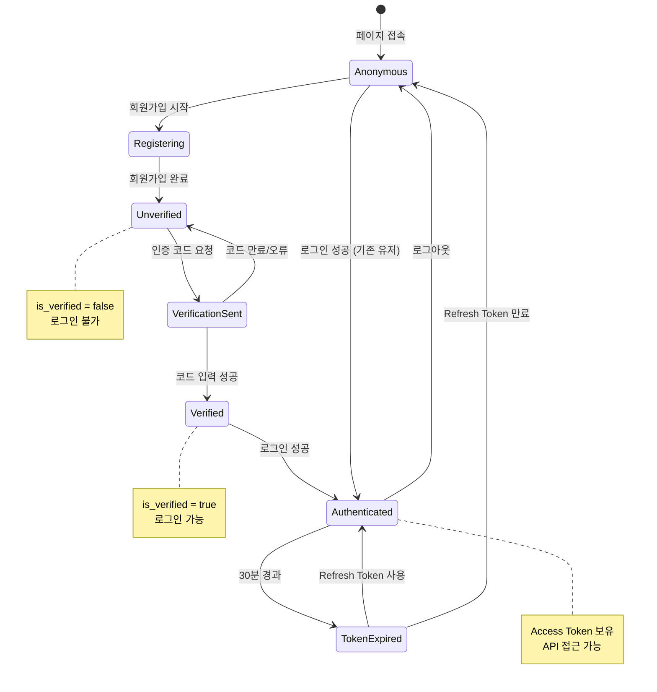

---

## 컴포넌트 관계도

### Frontend 컴포넌트 계층

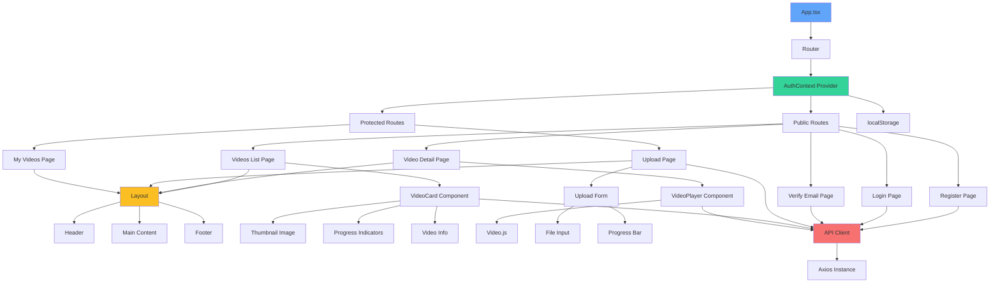

### Backend 서비스 계층

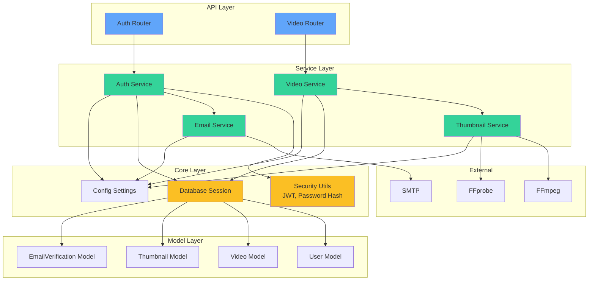

---

## 배포 아키텍처

### 현재 개발 환경

```mermaid
graph TB
    subgraph "Developer Machine"
        subgraph "Frontend Container"
            A[Vite Dev Server<br/>:5174]
            B[React App<br/>Hot Reload]
        end

        subgraph "Backend Container"
            C[Uvicorn Server<br/>:8000]
            D[FastAPI App<br/>Auto Reload]
        end

        subgraph "Database"
            E[(PostgreSQL<br/>:5432)]
        end

        subgraph "File System"
            F[/tmp/videos/<br/>Video Files]
            G[/tmp/videos/thumbnails/<br/>Thumbnail Files]
        end

        subgraph "External Services"
            H[Gmail SMTP<br/>:587]
            I[FFmpeg/FFprobe<br/>Local Binary]
        end
    end

    A -->|API Requests| C
    C -->|Database Queries| E
    C -->|File Operations| F
    C -->|Thumbnail Operations| G
    C -->|Video Processing| I
    C -->|Send Email| H

    B -->|HTTP Stream| C

    style A fill:#60a5fa
    style C fill:#34d399
    style E fill:#fbbf24
    style F fill:#f87171
    style G fill:#f87171
```

### 프로덕션 아키텍처 (계획)

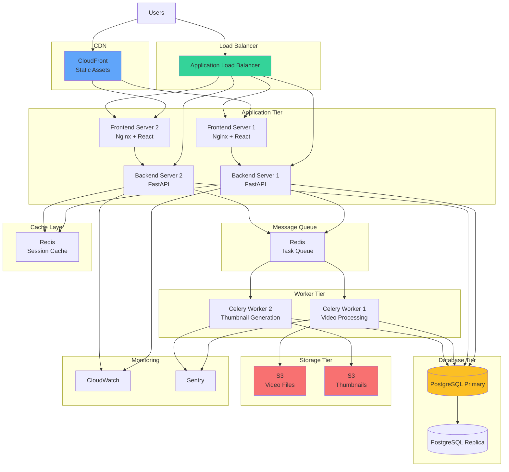

---

## 네트워크 플로우

### API 요청 흐름 (인증 포함)

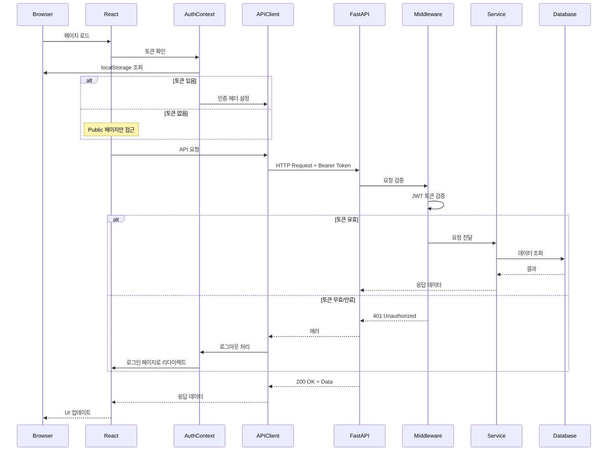

---

## 에러 처리 플로우

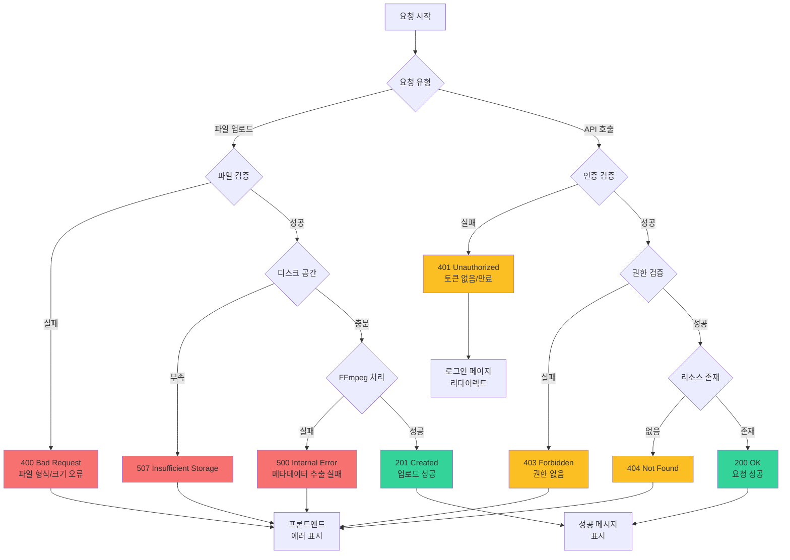

---

## 성능 최적화 전략

### 프론트엔드 최적화

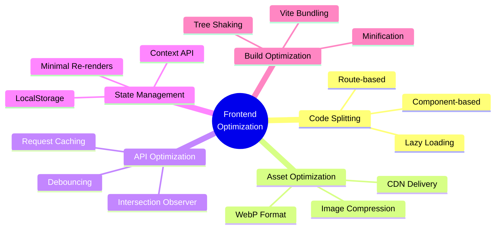

### 백엔드 최적화

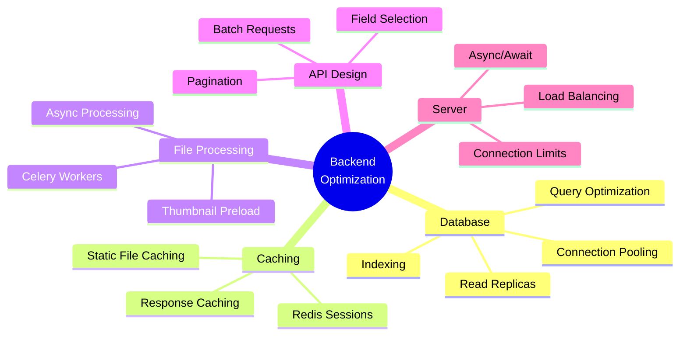

---

## 보안 계층

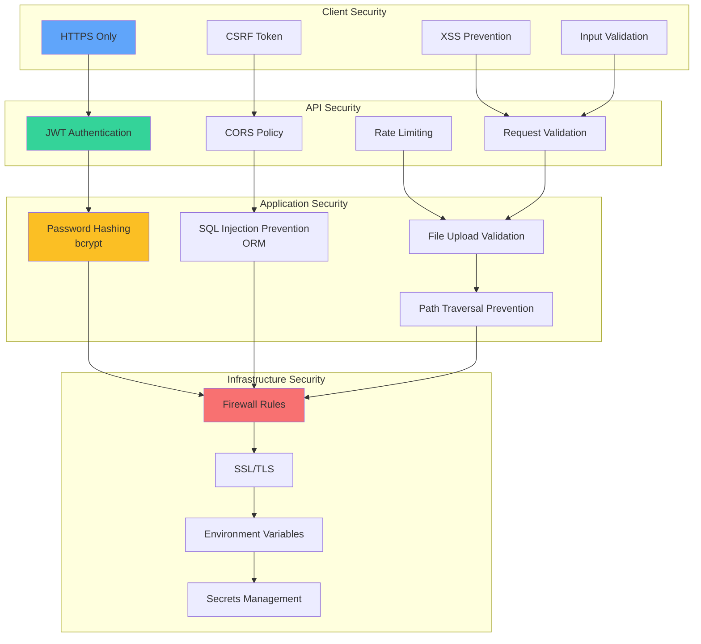

---

## 모니터링 및 로깅

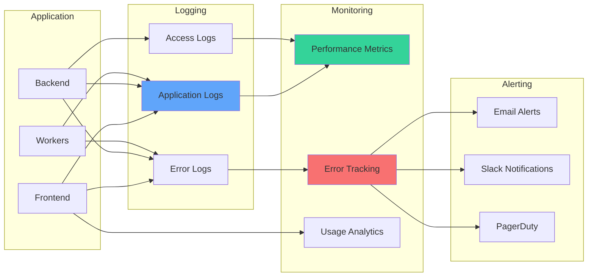

---

## 데이터 백업 및 복구

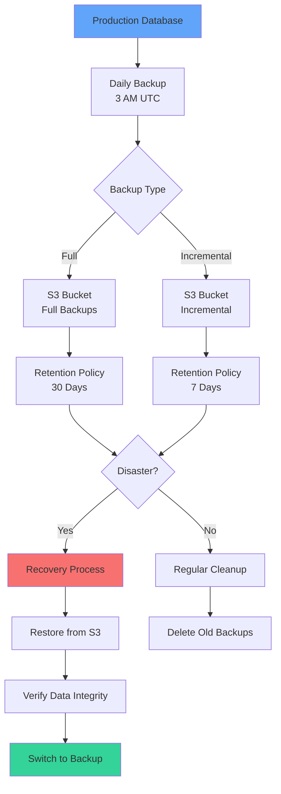

---

이 문서는 시스템의 전체적인 흐름과 상호작용을 시각화하여 이해를 돕습니다. 각 다이어그램은 Mermaid 형식으로 작성되어 GitHub, Notion 등 대부분의 마크다운 렌더러에서 자동으로 표시됩니다.
