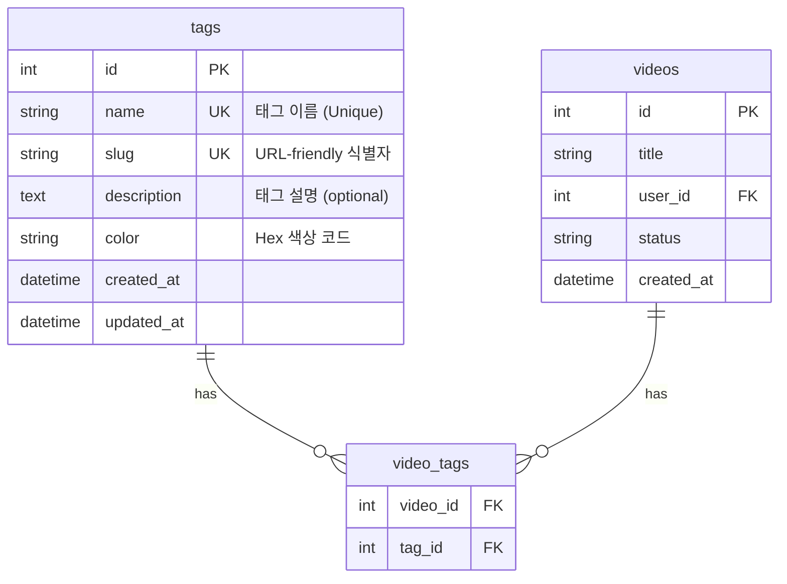
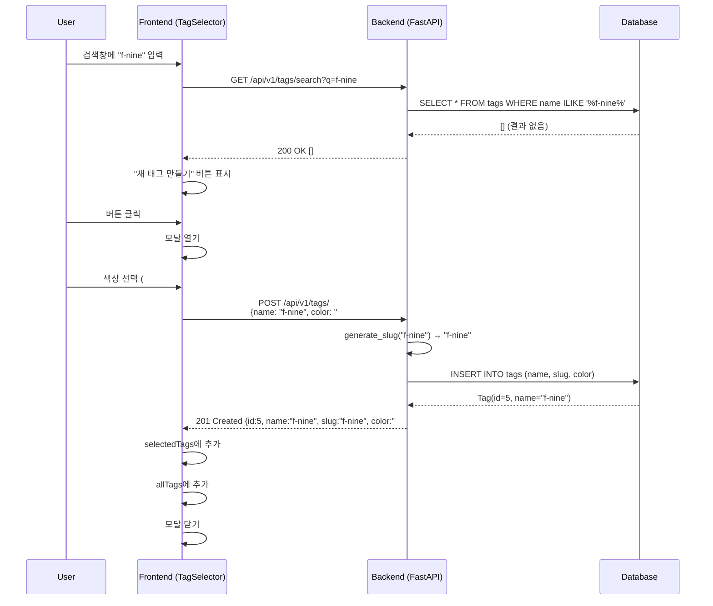
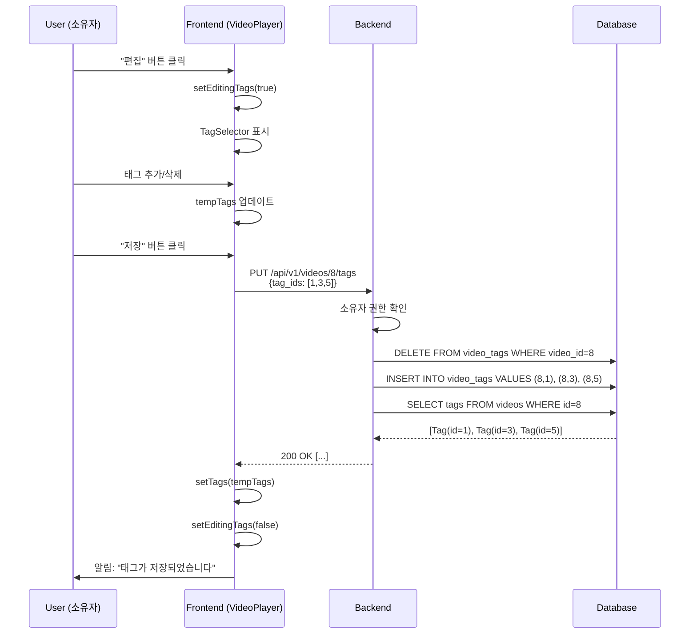
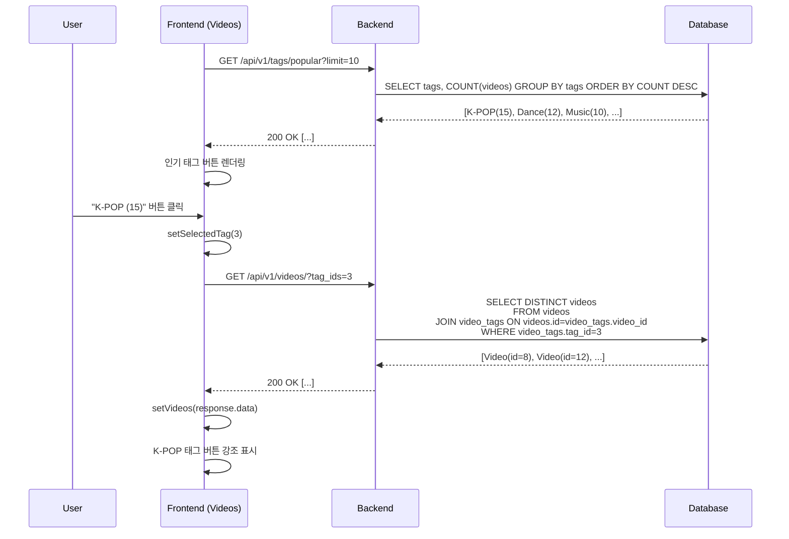
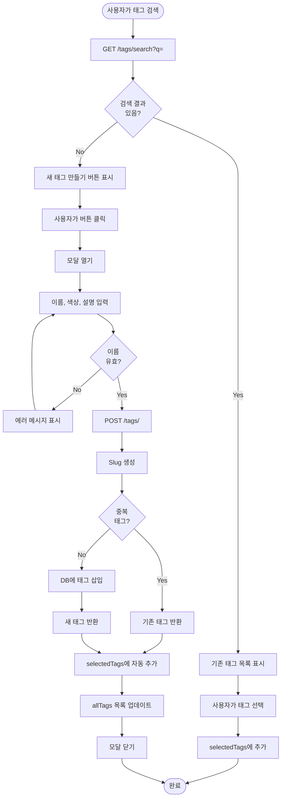
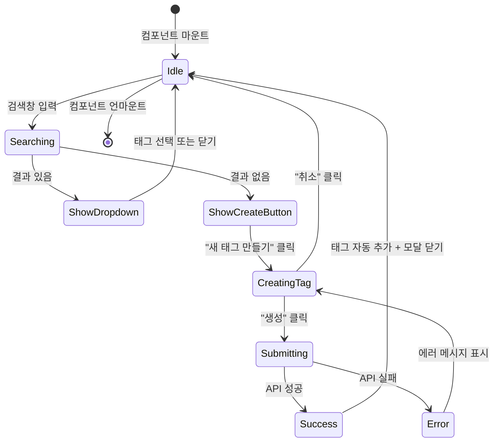

# v0.5 - 태그 시스템 (Tag System)

**버전:** v0.5
**개발 기간:** 2026-01-08
**상태:** ✅ 완료

---

## 📋 목차

1. [개요](#개요)
2. [데이터베이스 스키마](#데이터베이스-스키마)
3. [백엔드 API](#백엔드-api)
4. [프론트엔드 구현](#프론트엔드-구현)
5. [주요 기능](#주요-기능)
6. [기술적 세부사항](#기술적-세부사항)
7. [트러블슈팅](#트러블슈팅)

---

## 개요

### 목적
비디오에 태그를 추가하여 카테고리화 및 검색/필터링을 가능하게 하는 시스템 구축

### 주요 요구사항
- ✅ 태그 CRUD 기능
- ✅ 비디오-태그 다대다(Many-to-Many) 관계
- ✅ 태그 검색 및 자동완성
- ✅ 비디오 업로드 시 태그 선택
- ✅ 비디오 상세 페이지에서 태그 편집
- ✅ 태그별 비디오 필터링
- ✅ **새 태그 생성 기능 (모달)**
- ✅ 색상 커스터마이징

### 기술 스택
- **Backend:** FastAPI, SQLAlchemy 2.0 (Async), Pydantic
- **Frontend:** React 18, TypeScript, TailwindCSS
- **Database:** PostgreSQL (Many-to-Many relationship)

---

## 데이터베이스 스키마

### ERD



### 테이블 정의

#### 1. `tags` 테이블

| 컬럼 | 타입 | 제약조건 | 설명 |
|------|------|---------|------|
| id | INTEGER | PK, AUTO_INCREMENT | 태그 고유 ID |
| name | VARCHAR(100) | UNIQUE, NOT NULL, INDEX | 태그 이름 |
| slug | VARCHAR(100) | UNIQUE, NOT NULL, INDEX | URL-friendly 슬러그 |
| description | TEXT | NULL | 태그 설명 |
| color | VARCHAR(7) | NOT NULL, DEFAULT '#3B82F6' | Hex 색상 코드 |
| created_at | DATETIME | NOT NULL | 생성 일시 |
| updated_at | DATETIME | NOT NULL | 수정 일시 |

**인덱스:**
- `idx_tags_name`: name 컬럼
- `idx_tags_slug`: slug 컬럼

**제약조건:**
- name: 알파벳, 숫자, 한글, 하이픈(-), 공백만 허용
- color: Hex 색상 형식 (#RRGGBB)

#### 2. `video_tags` 테이블 (Association Table)

| 컬럼 | 타입 | 제약조건 | 설명 |
|------|------|---------|------|
| video_id | INTEGER | FK (videos.id), PK | 비디오 ID |
| tag_id | INTEGER | FK (tags.id), PK | 태그 ID |

**복합 Primary Key:** (video_id, tag_id)

---

## 백엔드 API

### API 엔드포인트 목록

#### 태그 관리

| 메서드 | 엔드포인트 | 인증 | 설명 |
|--------|-----------|------|------|
| POST | `/api/v1/tags/` | ✅ | 새 태그 생성 |
| GET | `/api/v1/tags/` | ❌ | 전체 태그 조회 (검색 지원) |
| GET | `/api/v1/tags/popular` | ❌ | 인기 태그 조회 (비디오 개수순) |
| GET | `/api/v1/tags/search?q=` | ❌ | 태그 검색 (자동완성) |
| GET | `/api/v1/tags/{id}` | ❌ | 태그 상세 조회 |
| GET | `/api/v1/tags/slug/{slug}` | ❌ | Slug로 태그 조회 |
| PUT | `/api/v1/tags/{id}` | ✅ | 태그 수정 |
| DELETE | `/api/v1/tags/{id}` | ✅ | 태그 삭제 |

#### 비디오-태그 관계

| 메서드 | 엔드포인트 | 인증 | 설명 |
|--------|-----------|------|------|
| GET | `/api/v1/videos/{id}/tags` | ❌ | 비디오 태그 조회 |
| POST | `/api/v1/videos/{id}/tags` | ✅ (소유자) | 태그 추가 |
| PUT | `/api/v1/videos/{id}/tags` | ✅ (소유자) | 태그 전체 교체 |
| DELETE | `/api/v1/videos/{id}/tags/{tag_id}` | ✅ (소유자) | 특정 태그 삭제 |

#### 비디오 필터링

| 메서드 | 엔드포인트 | 파라미터 | 설명 |
|--------|-----------|---------|------|
| GET | `/api/v1/videos/` | `?tag_ids=1,2,3` | 태그별 비디오 필터링 |

### API 상세 명세

#### 1. POST `/api/v1/tags/` - 태그 생성

**Request:**
```json
{
  "name": "f-nine",
  "description": "F9 그룹 관련 태그",
  "color": "#FF6B6B"
}
```

**Response:** `201 Created`
```json
{
  "id": 5,
  "name": "f-nine",
  "slug": "f-nine",
  "color": "#FF6B6B"
}
```

**Validation:**
- name: 1-100자, 알파벳/숫자/한글/하이픈/공백만 허용
- color: Hex 색상 형식 (#RRGGBB)
- description: 최대 500자 (optional)

**에러:**
- `400`: 중복된 태그 이름 → 기존 태그 반환
- `422`: 유효성 검증 실패

---

#### 2. GET `/api/v1/tags/` - 전체 태그 조회

**Query Parameters:**
- `skip`: 페이지네이션 오프셋 (기본: 0)
- `limit`: 최대 결과 개수 (기본: 100, 최대: 100)
- `search`: 검색 쿼리 (optional)

**Response:** `200 OK`
```json
[
  {
    "id": 1,
    "name": "Music",
    "slug": "music",
    "description": "Music videos",
    "color": "#FF6B6B",
    "created_at": "2026-01-07T06:03:38.507737",
    "updated_at": "2026-01-07T06:03:38.507741",
    "video_count": 5
  }
]
```

---

#### 3. GET `/api/v1/tags/popular?limit=10` - 인기 태그

**Query Parameters:**
- `limit`: 결과 개수 (기본: 10, 최대: 50)

**Response:** `200 OK`
```json
[
  {
    "id": 3,
    "name": "K-POP",
    "slug": "k-pop",
    "color": "#95E1D3",
    "video_count": 15
  }
]
```

**정렬:** video_count DESC

---

#### 4. GET `/api/v1/tags/search?q=k` - 태그 검색

**Query Parameters:**
- `q`: 검색어 (필수)

**Response:** `200 OK`
```json
[
  {
    "id": 3,
    "name": "K-POP",
    "slug": "k-pop",
    "color": "#95E1D3"
  }
]
```

**검색 범위:** name, description (ILIKE)

---

#### 5. PUT `/api/v1/videos/{id}/tags` - 비디오 태그 업데이트

**Request:**
```json
{
  "tag_ids": [1, 3, 5]
}
```

**Response:** `200 OK`
```json
[
  {
    "id": 1,
    "name": "Music",
    "slug": "music",
    "color": "#FF6B6B"
  }
]
```

**권한:** 비디오 소유자만 가능 (403 Forbidden)

---

#### 6. GET `/api/v1/videos/?tag_ids=1` - 태그 필터링

**Query Parameters:**
- `tag_ids`: 태그 ID (단일 또는 다중)

**Response:** `200 OK`
```json
[
  {
    "id": 8,
    "title": "직캠",
    "tags": [
      {"id": 1, "name": "Music", "color": "#FF6B6B"}
    ]
  }
]
```

**SQL:** INNER JOIN + DISTINCT

---

## 프론트엔드 구현

### 컴포넌트 구조

```
src/
├── components/
│   └── tag/
│       └── TagSelector.tsx      ← 태그 선택/생성 컴포넌트
├── pages/
│   ├── UploadVideo.tsx          ← 업로드 시 태그 선택
│   ├── VideoPlayer.tsx          ← 상세 페이지 태그 편집
│   └── Videos.tsx               ← 리스트 페이지 태그 필터
└── services/
    └── api.client.ts
```

### 1. TagSelector 컴포넌트

**파일:** `frontend/src/components/tag/TagSelector.tsx`

#### Props

```typescript
interface TagSelectorProps {
  selectedTags: Tag[];
  onTagsChange: (tags: Tag[]) => void;
  maxTags?: number;  // 기본값: 10
}
```

#### 주요 기능

1. **태그 검색 및 자동완성**
   - 실시간 검색 (API: `/tags/search?q=`)
   - 드롭다운으로 결과 표시
   - Click-outside 감지로 자동 닫기

2. **선택된 태그 표시**
   - 색상별 배지 (Badge)
   - X 버튼으로 제거
   - 최대 개수 제한

3. **새 태그 생성**
   - 검색 결과 없을 시 "새 태그 만들기" 버튼
   - 모달 팝업으로 생성 폼 표시

#### 새 태그 생성 모달

**UI 구성:**

```
┌─────────────────────────────────┐
│  새 태그 만들기                    │
├─────────────────────────────────┤
│  태그 이름 *                      │
│  [f-nine                    ]   │
│                                 │
│  색상                            │
│  [🎨] [#FF6B6B           ]      │
│  [🔴][💎][🌱][🌟][🔵][💜][💗][💚]  │
│                                 │
│  설명 (선택사항)                  │
│  [F9 그룹 관련 태그...    ]      │
│                                 │
│  미리보기                        │
│  [ f-nine ]  ← 실시간 업데이트   │
│                                 │
│  [  생성  ] [  취소  ]           │
└─────────────────────────────────┘
```

**Preset 색상:**
```typescript
const presetColors = [
  '#FF6B6B',  // 빨강
  '#4ECDC4',  // 민트
  '#95E1D3',  // 연두
  '#F7DC6F',  // 노랑
  '#3B82F6',  // 파랑
  '#8B5CF6',  // 보라
  '#EC4899',  // 핑크
  '#10B981'   // 초록
];
```

**코드 예시:**

```typescript
const handleSubmitNewTag = async () => {
  const response = await apiClient.post('/tags/', {
    name: newTagName.trim(),
    description: newTagDescription.trim() || undefined,
    color: newTagColor
  });

  const newTag = response.data;

  // 자동으로 선택된 태그에 추가
  onTagsChange([...selectedTags, newTag]);

  // 전체 태그 목록 업데이트
  setAllTags([...allTags, newTag]);
};
```

---

### 2. 비디오 업로드 페이지

**파일:** `frontend/src/pages/UploadVideo.tsx:153-157`

```typescript
// 태그 선택 UI
<TagSelector
  selectedTags={selectedTags}
  onTagsChange={setSelectedTags}
  maxTags={10}
/>

// 업로드 완료 후 태그 저장
const videoId = response.data.id;

if (selectedTags.length > 0) {
  await apiClient.post(`/videos/${videoId}/tags`, {
    tag_ids: selectedTags.map(tag => tag.id)
  });
}
```

---

### 3. 비디오 상세 페이지

**파일:** `frontend/src/pages/VideoPlayer.tsx:350-410`

```typescript
// 태그 편집 UI
{isOwner && !editingTags && (
  <button onClick={handleEditTags}>편집</button>
)}

{editingTags ? (
  <div>
    <TagSelector
      selectedTags={tempTags}
      onTagsChange={setTempTags}
      maxTags={10}
    />
    <button onClick={handleSaveTags}>저장</button>
    <button onClick={handleCancelEditTags}>취소</button>
  </div>
) : (
  <div>
    {tags.map(tag => (
      <span style={{ color: tag.color }}>{tag.name}</span>
    ))}
  </div>
)}

// 저장 함수
const handleSaveTags = async () => {
  await apiClient.put(`/videos/${video.id}/tags`, {
    tag_ids: tempTags.map(tag => tag.id)
  });
  setTags(tempTags);
  setEditingTags(false);
};
```

**권한 체크:**
```typescript
const isOwner = video.user_id === currentUser?.id;
```

---

### 4. 비디오 리스트 페이지

**파일:** `frontend/src/pages/Videos.tsx:88-124`

```typescript
// 인기 태그 로드
const loadPopularTags = async () => {
  const response = await apiClient.get('/tags/popular?limit=10');
  setTags(response.data);
};

// 태그 필터링
const loadVideos = async () => {
  const params = selectedTag ? `?tag_ids=${selectedTag}` : '';
  const response = await apiClient.get(`/videos/${params}`);
  setVideos(response.data);
};

// UI
<div>
  <button onClick={() => setSelectedTag(null)}>전체</button>

  {tags.map(tag => (
    <button
      onClick={() => handleTagClick(tag.id)}
      style={{
        backgroundColor: selectedTag === tag.id ? tag.color : tag.color + '40',
        border: `1px solid ${tag.color}`
      }}
    >
      {tag.name} ({tag.video_count})
    </button>
  ))}
</div>
```

**스타일:**
- 선택된 태그: ring-2 효과, 진한 색상
- 미선택 태그: 40% 투명도

---

## 주요 기능

### 1. Slug 자동 생성

**목적:** SEO-friendly URL 생성

**알고리즘:**
```python
@staticmethod
def generate_slug(name: str) -> str:
    """
    Generate URL-friendly slug from tag name

    Examples:
      "K-POP" -> "k-pop"
      "f nine" -> "f-nine"
      "댄스 커버" -> "댄스-커버"
    """
    slug = name.lower()
    slug = re.sub(r'[^\w\s-]', '', slug)  # 특수문자 제거
    slug = re.sub(r'[-\s]+', '-', slug)   # 공백/하이픈 정규화
    slug = slug.strip('-')                # 앞뒤 하이픈 제거
    return slug
```

---

### 2. 중복 태그 방지

**전략:** 중복 시 기존 태그 반환 (에러 X)

```python
async def create(self, db: AsyncSession, tag_data: TagCreate) -> Tag:
    # Slug 생성
    slug = self.generate_slug(tag_data.name)

    # 기존 태그 확인
    existing_tag = await self.get_by_slug(db, slug)
    if existing_tag:
        return existing_tag  # 중복 시 기존 태그 반환

    # 새 태그 생성
    tag = Tag(
        name=tag_data.name,
        slug=slug,
        description=tag_data.description,
        color=tag_data.color
    )
    db.add(tag)
    await db.commit()
    await db.refresh(tag)
    return tag
```

---

### 3. 태그 검색

**기능:** 실시간 자동완성

```python
async def search(self, db: AsyncSession, query: str) -> List[Tag]:
    """
    Search tags by name or description
    Case-insensitive, supports Korean
    """
    search_query = select(Tag).where(
        or_(
            Tag.name.ilike(f"%{query}%"),
            Tag.description.ilike(f"%{query}%")
        )
    ).order_by(Tag.name)

    result = await db.execute(search_query)
    return list(result.scalars().all())
```

**프론트엔드:**
```typescript
useEffect(() => {
  if (searchQuery.trim().length > 0) {
    searchTags(searchQuery);  // Debounced
  } else {
    setSearchResults(allTags);
  }
}, [searchQuery, allTags]);
```

---

### 4. 인기 태그 조회

**정렬:** video_count DESC

```python
async def get_popular(self, db: AsyncSession, limit: int = 10) -> List[tuple[Tag, int]]:
    query = (
        select(Tag, func.count(video_tags.c.video_id).label('video_count'))
        .outerjoin(video_tags, Tag.id == video_tags.c.tag_id)
        .group_by(Tag.id)
        .order_by(func.count(video_tags.c.video_id).desc())
        .limit(limit)
    )
    result = await db.execute(query)
    return [(row[0], row[1]) for row in result.all()]
```

---

### 5. 비디오 필터링

**SQL JOIN:**
```python
if tag_ids:
    query = (
        query
        .join(video_tags, Video.id == video_tags.c.video_id)
        .where(video_tags.c.tag_id.in_(tag_ids))
        .distinct()
    )
```

**설명:**
- INNER JOIN으로 태그가 있는 비디오만 조회
- DISTINCT로 중복 제거
- 다중 태그 지원 (OR 조건)

---

## 기술적 세부사항

### 1. Many-to-Many 관계 구현

**Association Table:**
```python
video_tags = Table(
    'video_tags',
    Base.metadata,
    Column('video_id', Integer, ForeignKey('videos.id'), primary_key=True),
    Column('tag_id', Integer, ForeignKey('tags.id'), primary_key=True)
)
```

**Relationship:**
```python
# Tag 모델
videos = relationship("Video", secondary="video_tags", back_populates="tags")

# Video 모델
tags = relationship("Tag", secondary="video_tags", back_populates="videos")
```

---

### 2. Async SQLAlchemy 쿼리

**예시:**
```python
# 태그 조회 (relationship 로드)
result = await db.execute(
    select(Video)
    .options(selectinload(Video.tags))
    .where(Video.id == video_id)
)
video = result.scalar_one_or_none()
```

**주의사항:**
- `selectinload()`: relationship 미리 로드
- 안 하면 lazy loading → MissingGreenlet 에러

---

### 3. Pydantic Validation

**스키마:**
```python
class TagBase(BaseModel):
    name: str = Field(..., min_length=1, max_length=100)
    description: Optional[str] = Field(None, max_length=500)
    color: str = Field("#3B82F6", pattern="^#[0-9A-Fa-f]{6}$")

    @validator('name')
    def validate_name(cls, v):
        if not re.match(r'^[\w\s\-가-힣]+$', v):
            raise ValueError('Invalid characters')
        return v.strip()
```

**허용 문자:**
- 알파벳 (a-z, A-Z)
- 숫자 (0-9)
- 한글 (가-힣)
- 하이픈 (-)
- 공백

---

### 4. React State Management

**상태 구조:**
```typescript
// TagSelector
const [searchQuery, setSearchQuery] = useState('');
const [searchResults, setSearchResults] = useState<Tag[]>([]);
const [isDropdownOpen, setIsDropdownOpen] = useState(false);
const [isCreatingTag, setIsCreatingTag] = useState(false);

// VideoPlayer
const [tags, setTags] = useState<Tag[]>([]);
const [editingTags, setEditingTags] = useState(false);
const [tempTags, setTempTags] = useState<Tag[]>([]);

// Videos
const [selectedTag, setSelectedTag] = useState<number | null>(null);
```

---

### 5. Click-Outside 감지

**구현:**
```typescript
useEffect(() => {
  const handleClickOutside = (event: MouseEvent) => {
    if (dropdownRef.current && !dropdownRef.current.contains(event.target as Node)) {
      setIsDropdownOpen(false);
    }
  };

  document.addEventListener('mousedown', handleClickOutside);
  return () => document.removeEventListener('mousedown', handleClickOutside);
}, []);
```

---

## 트러블슈팅

### 문제 1: ResponseValidationError - video_count

**에러 메시지:**
```
ResponseValidationError: 'video_count'
MissingGreenlet: greenlet_spawn has not been called
```

**원인:**
- Tag 모델에 `@property video_count` 정의
- Pydantic validation 중 `len(self.videos)` 호출
- Async relationship이 로드되지 않음
- → Greenlet 에러

**해결책:**
```python
# 변경 전
@router.post("/", response_model=TagResponse, ...)  # ❌ video_count 포함

# 변경 후
@router.post("/", response_model=TagSimple, ...)  # ✅ video_count 없음
```

**설명:**
- TagResponse: id, name, slug, color, video_count
- TagSimple: id, name, slug, color만 반환
- 새 태그는 어차피 video_count = 0
- Relationship 로드 불필요

---

### 문제 2: CORS vs 500 에러 구분

**표면 에러:**
```
Access to XMLHttpRequest blocked by CORS policy
```

**실제 원인:**
- 백엔드 500 에러로 인한 응답 실패
- CORS가 아님!

**구분 방법:**
| CORS 에러 | 500 에러 |
|-----------|----------|
| OPTIONS 요청 실패 | OPTIONS 성공 (200 OK) |
| 백엔드 로그 없음 | 백엔드 ERROR 로그 |
| 브라우저에만 표시 | 백엔드 Traceback |

---

## 시퀀스 다이어그램

### 1. 새 태그 생성 흐름



---

### 2. 비디오 태그 편집 흐름



---

### 3. 태그 필터링 흐름



---

## 플로우차트

### 태그 생성 로직



---

## 상태 다이어그램

### TagSelector 상태 전이



---

## 파일 변경 사항

### 생성된 파일

1. **Backend**
   ```
   backend/app/schemas/tag.py             (72줄)
   backend/app/services/tag_service.py    (182줄)
   backend/app/api/v1/tags.py             (167줄)
   ```

2. **Frontend**
   ```
   frontend/src/components/tag/TagSelector.tsx  (358줄)
   ```

### 수정된 파일

1. **Backend**
   ```
   backend/app/api/v1/videos.py           (+77줄) - 비디오-태그 관계 API
   backend/app/api/v1/router.py           (+2줄)  - 태그 라우터 등록
   backend/app/services/video_service.py  (+15줄) - 태그 필터링 로직
   ```

2. **Frontend**
   ```
   frontend/src/pages/UploadVideo.tsx     (+24줄) - 태그 선택 UI
   frontend/src/pages/VideoPlayer.tsx     (+89줄) - 태그 편집 UI
   frontend/src/pages/Videos.tsx          (+38줄) - 태그 필터링 UI
   ```

---

## 테스트 시나리오

### 1. 태그 생성 테스트

**시나리오:**
1. 비디오 업로드 페이지 접속
2. 태그 검색창에 "f-nine" 입력
3. "새 태그 만들기" 버튼 클릭
4. 색상 #FF6B6B 선택
5. "생성" 버튼 클릭

**예상 결과:**
- ✅ 태그가 DB에 저장됨
- ✅ selectedTags에 자동 추가
- ✅ 모달 닫힘

---

### 2. 태그 편집 테스트

**시나리오:**
1. 비디오 상세 페이지 접속 (소유자)
2. "편집" 버튼 클릭
3. 태그 추가/삭제
4. "저장" 버튼 클릭

**예상 결과:**
- ✅ PUT /videos/{id}/tags 호출
- ✅ DB 업데이트
- ✅ UI 즉시 반영

---

### 3. 태그 필터링 테스트

**시나리오:**
1. 비디오 리스트 페이지 접속
2. "K-POP (15)" 태그 클릭

**예상 결과:**
- ✅ K-POP 태그 비디오만 표시
- ✅ 선택 태그 강조 표시
- ✅ "전체" 버튼으로 필터 해제 가능

---

### 4. 중복 태그 방지 테스트

**시나리오:**
1. "Music" 태그 생성 시도 (이미 존재)

**예상 결과:**
- ✅ 에러 없이 기존 태그 반환
- ✅ selectedTags에 추가

---

## 성능 최적화

### 1. 인덱싱

```sql
CREATE INDEX idx_tags_name ON tags(name);
CREATE INDEX idx_tags_slug ON tags(slug);
CREATE INDEX idx_video_tags_video_id ON video_tags(video_id);
CREATE INDEX idx_video_tags_tag_id ON video_tags(tag_id);
```

### 2. N+1 문제 해결

**문제:**
```python
# ❌ N+1 쿼리 발생
videos = await db.execute(select(Video))
for video in videos:
    tags = video.tags  # 각 비디오마다 쿼리!
```

**해결:**
```python
# ✅ 한 번에 로드
videos = await db.execute(
    select(Video).options(selectinload(Video.tags))
)
```

---

## 향후 개선 사항

### 1. 태그 계층 구조
- 부모-자식 태그 관계
- 예: "K-POP" → "아이돌", "솔로"

### 2. 태그 통계
- 태그별 조회수
- 트렌딩 태그

### 3. 태그 추천
- 유사 태그 제안
- AI 기반 자동 태그

### 4. 태그 병합
- 중복/유사 태그 통합
- 관리자 기능

---

## 참고 자료

### API 문서
- FastAPI Swagger UI: http://localhost:8000/docs

### 프론트엔드 접속
- 업로드: http://localhost:5174/upload
- 비디오 리스트: http://localhost:5174/videos
- 비디오 상세: http://localhost:5174/videos/{id}

### 코드 위치
- Backend: `/backend/app/`
- Frontend: `/frontend/src/`
- 문서: `/doc/dev_Process/`

---

**작성일:** 2026-01-08
**작성자:** Claude Sonnet 4.5
**버전:** v0.5
