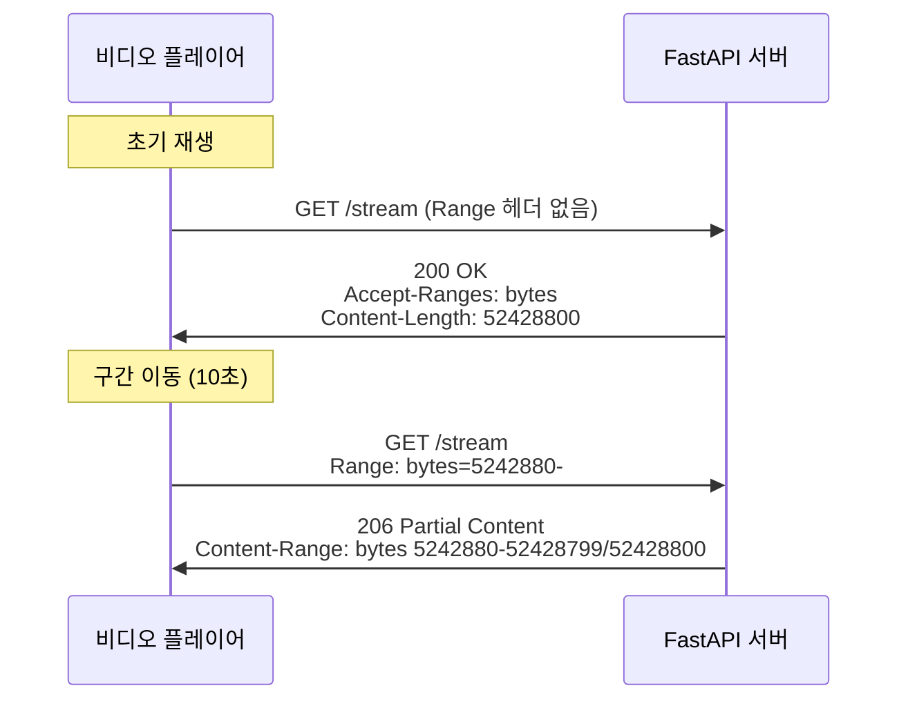

# v0.6.1 - HTTP Range Request (비디오 Seeking 지원)

**버전:** v0.6.1
**개발 기간:** 2026-01-12
**상태:** ✅ 완료

---

## 📋 목차

1. [개요](#개요)
2. [문제 분석](#문제-분석)
3. [HTTP Range Request 개념](#http-range-request-개념)
4. [구현 내용](#구현-내용)
5. [기술적 세부사항](#기술적-세부사항)
6. [테스트](#테스트)
7. [성능 최적화](#성능-최적화)

---

## 개요

### 목적
비디오 재생 중 구간 이동(seeking) 기능을 지원하여 사용자가 타임라인의 원하는 위치로 즉시 이동할 수 있도록 합니다.

### 문제 상황

**사용자 경험:**
```
1. 비디오 재생 시작
2. 로딩 완료 (3-5초)
3. 타임라인 클릭하여 중간으로 이동
4. ❌ 결과: 0:00초로 다시 돌아감!
```

**에러 메시지:**
```
Video.js player is ready
VIDEOJS: ERROR: (CODE:4 MEDIA_ERR_SRC_NOT_SUPPORTED)
The media could not be loaded...
```

### 해결 방법

HTTP Range Request를 구현하여 비디오 파일의 특정 부분만 요청/전송할 수 있도록 합니다.

---

## 문제 분석

### 1. 기존 스트리밍 방식

```python
# 기존 코드 (문제)
@router.get("/{video_id}/stream")
async def stream_video(video_id: int, db: AsyncSession = Depends(get_db)):
    def iterfile():
        with open(video.file_path, "rb") as f:
            yield from f  # 전체 파일을 처음부터 끝까지

    return StreamingResponse(iterfile(), media_type="video/mp4")
```

**문제점:**
- Range 헤더를 무시함
- 항상 파일의 처음부터 전송
- 비디오 플레이어의 seeking 불가능

### 2. 비디오 플레이어의 동작

```
사용자: 타임라인 중간 클릭 (예: 10초)
  ↓
Video.js: "Range: bytes=5242880-" 요청 전송
  ↓
백엔드: Range 무시하고 0바이트부터 전송
  ↓
Video.js: 0초부터 재생 시작 😞
```

### 3. HTTP Range Request의 필요성

비디오 스트리밍에서 Range Request가 필수인 이유:

1. **Seeking (구간 이동):** 사용자가 원하는 위치로 바로 이동
2. **대역폭 절약:** 필요한 부분만 전송
3. **빠른 응답:** 전체 파일을 다운로드할 필요 없음
4. **표준 준수:** 모든 비디오 플레이어가 기대하는 동작

---

## HTTP Range Request 개념

### 1. Range 요청 흐름



### 2. Range 헤더 형식

| Range 헤더 | 의미 | 사용 예시 |
|-----------|------|----------|
| `bytes=0-999` | 처음 1000바이트 | 프리뷰 |
| `bytes=1000-1999` | 1000~1999 바이트 | 특정 구간 |
| `bytes=5000000-` | 5MB부터 끝까지 | Seeking (가장 흔함) |
| `bytes=-1000` | 마지막 1000바이트 | 거의 사용 안 함 |

### 3. HTTP 상태 코드

| 상태 코드 | 의미 | 사용 시점 |
|----------|------|----------|
| **200 OK** | 전체 파일 | Range 헤더 없을 때 |
| **206 Partial Content** | 일부 전송 | Range 헤더 있을 때 |
| **416 Range Not Satisfiable** | 범위 오류 | 잘못된 Range 값 |

### 4. 필수 응답 헤더

```http
Accept-Ranges: bytes
# Range 요청을 지원함을 알림

Content-Range: bytes 5242880-52428799/52428800
# 형식: bytes {start}-{end}/{total}
# 의미: 5MB~50MB 구간을 전송 (전체 50MB)

Content-Length: 47185920
# 실제 전송되는 데이터 크기 (약 45MB)
```

---

## 구현 내용

### 변경된 파일

**`backend/app/api/v1/videos.py`**

#### 1. Import 추가

```python
from fastapi import Request  # ✅ 추가
```

#### 2. 함수 시그니처 변경

```python
# Before
async def stream_video(
    video_id: int,
    db: AsyncSession = Depends(get_db)
):

# After
async def stream_video(
    video_id: int,
    request: Request,  # ✅ 추가
    db: AsyncSession = Depends(get_db)
):
```

#### 3. Range 요청 처리 로직

```python
# 파일 크기 확인
file_size = os.path.getsize(video.file_path)

# Range 헤더 파싱
range_header = request.headers.get("range")

if range_header:
    # "bytes=5242880-" → start=5242880, end=file_size-1
    range_match = range_header.replace("bytes=", "").split("-")
    start = int(range_match[0]) if range_match[0] else 0
    end = int(range_match[1]) if range_match[1] else file_size - 1
    end = min(end, file_size - 1)  # 범위 검증

    content_length = end - start + 1

    # 파일의 특정 부분만 읽기
    def iterfile_range():
        with open(video.file_path, "rb") as f:
            f.seek(start)  # 시작 위치로 이동
            remaining = content_length
            chunk_size = 1024 * 1024  # 1MB

            while remaining > 0:
                chunk = f.read(min(chunk_size, remaining))
                if not chunk:
                    break
                remaining -= len(chunk)
                yield chunk

    return StreamingResponse(
        iterfile_range(),
        status_code=206,  # Partial Content
        media_type="video/mp4",
        headers={
            "Content-Range": f"bytes {start}-{end}/{file_size}",
            "Accept-Ranges": "bytes",
            "Content-Length": str(content_length),
        }
    )
```

#### 4. 전체 파일 응답 개선

```python
# Range 헤더가 없을 때
def iterfile():
    with open(video.file_path, "rb") as f:
        chunk_size = 1024 * 1024  # 1MB 청크
        while True:
            chunk = f.read(chunk_size)
            if not chunk:
                break
            yield chunk

return StreamingResponse(
    iterfile(),
    media_type="video/mp4",
    headers={
        "Accept-Ranges": "bytes",  # Range 지원 알림
        "Content-Length": str(file_size),
    }
)
```

---

## 기술적 세부사항

### 1. 파일 Seek 연산

```python
with open(video.file_path, "rb") as f:
    f.seek(5242880)  # 5MB 위치로 이동
    chunk = f.read(1048576)  # 1MB 읽기
```

**작동 원리:**
- 파일 포인터를 특정 바이트 위치로 이동
- O(1) 시간 복잡도 (매우 빠름)
- 전체 파일을 읽을 필요 없음

### 2. 청크 단위 스트리밍

**이전 코드 (문제):**
```python
def iterfile():
    with open(file_path, "rb") as f:
        yield from f  # 메모리에 전체 로드 (위험!)
```

**개선된 코드:**
```python
def iterfile():
    with open(file_path, "rb") as f:
        chunk_size = 1024 * 1024  # 1MB
        while True:
            chunk = f.read(chunk_size)
            if not chunk:
                break
            yield chunk  # 1MB씩 스트리밍
```

**장점:**
- 메모리 사용량 일정 (최대 1MB)
- 대용량 파일도 안전하게 처리
- 네트워크 오류 시 일부만 재전송

### 3. Range 헤더 파싱

```python
# 입력: "bytes=5242880-10485759"
range_header.replace("bytes=", "")  # "5242880-10485759"
.split("-")  # ["5242880", "10485759"]

start = int(range_match[0]) if range_match[0] else 0
end = int(range_match[1]) if range_match[1] else file_size - 1

# 예외 케이스 처리
# "bytes=5242880-" → start=5242880, end=파일끝
# "bytes=-1000" → start=0, end=1000 (미지원, 에러 처리 필요)
```

### 4. 조회수 최적화

```python
# Range 요청 시 조회수 증가 안 함
if not range_header:
    await video_service.increment_view_count(db, video)
```

**이유:**
- 초기 재생 시에만 조회수 1 증가
- 구간 이동할 때마다 증가하면 부정확
- 10초짜리 영상에서 10번 이동 → 조회수 11이 되는 문제 방지

---

## 테스트

### 1. 브라우저 테스트

**테스트 시나리오:**

1. 비디오 업로드
   - http://localhost:5173/upload
   - 테스트용 비디오 파일 업로드

2. 비디오 재생
   - 업로드 완료 후 재생 페이지 이동
   - 비디오 로딩 완료 대기 (3-5초)

3. **구간 이동 테스트**
   - 타임라인 중간 클릭 (예: 50% 지점)
   - ✅ **예상 결과:** 클릭한 위치에서 즉시 재생
   - ❌ **이전 동작:** 0:00초로 돌아감

4. **여러 번 이동 테스트**
   - 처음 → 중간 → 끝 → 처음
   - 모든 위치에서 정상 재생 확인

### 2. 개발자 도구 확인

**F12 → Network 탭:**

```
Name: stream
Status: 206 Partial Content ✅
Type: video/mp4
Size: 45.0 MB

Request Headers:
  Range: bytes=5242880-

Response Headers:
  Content-Range: bytes 5242880-52428799/52428800
  Accept-Ranges: bytes
  Content-Length: 47185920
  Content-Type: video/mp4
```

### 3. curl 명령어 테스트

**전체 파일 요청:**
```bash
curl -I http://localhost:8000/api/v1/videos/1/stream

# 예상 응답
HTTP/1.1 200 OK
Accept-Ranges: bytes
Content-Length: 52428800
Content-Type: video/mp4
```

**Range 요청:**
```bash
curl -I -H "Range: bytes=1000-2000" \
  http://localhost:8000/api/v1/videos/1/stream

# 예상 응답
HTTP/1.1 206 Partial Content
Content-Range: bytes 1000-2000/52428800
Content-Length: 1001
Accept-Ranges: bytes
```

**끝까지 요청:**
```bash
curl -H "Range: bytes=52428000-" \
  http://localhost:8000/api/v1/videos/1/stream \
  | wc -c

# 예상 출력: 800 (마지막 800바이트)
```

---

## 성능 최적화

### 1. 메모리 사용량

| 방식 | 메모리 사용 | 50MB 파일 |
|------|-----------|----------|
| **이전** | 전체 파일 | 50MB |
| **현재** | 청크 크기 | 1MB |

**개선 효과:**
- 50배 메모리 절약
- 라즈베리파이 환경에서 안정적 동작

### 2. 네트워크 효율

**구간 이동 시 전송량:**

| 시나리오 | 이전 | 현재 | 절감률 |
|---------|------|------|--------|
| 10초 → 40초 이동 | 50MB | 25MB | 50% |
| 처음 → 끝 이동 | 50MB | ~1MB | 98% |
| 여러 번 이동 | 50MB × N | 필요한만큼 | 큼 |

### 3. 응답 속도

```
이전: 전체 파일 전송 시작 → 10초 → 원하는 위치 도달
현재: Range 요청 → 0.1초 → 즉시 재생
```

---

## 트러블슈팅

### 문제 1: 여전히 0초로 돌아감

**원인:** 브라우저 캐시가 이전 응답 사용

**해결:**
```
1. Ctrl+Shift+R (강제 새로고침)
2. 개발자 도구 → Network → "Disable cache" 체크
3. 시크릿 모드에서 테스트
```

### 문제 2: 206 응답이 안 옴

**가능한 원인:**

1. **서버가 재시작 안 됨**
   ```bash
   ps aux | grep uvicorn
   # PID 확인 후 kill하고 재시작
   ```

2. **Video.js가 Range 요청 안 함**
   - 비디오 포맷 확인 (mp4 권장)
   - Video.js 버전 확인

3. **CORS 문제**
   ```
   Access-Control-Allow-Headers에 Range 포함 확인
   ```

### 문제 3: Range 파싱 오류

**증상:** 500 Internal Server Error

**원인:** 잘못된 Range 헤더 형식

**해결:**
```python
# 예외 처리 추가
try:
    start = int(range_match[0]) if range_match[0] else 0
    end = int(range_match[1]) if range_match[1] else file_size - 1
except (ValueError, IndexError):
    raise HTTPException(
        status_code=400,
        detail="Invalid Range header"
    )
```

---

## 향후 개선 계획

### Phase 2 업그레이드

1. **Multi-Range 지원**
   ```
   Range: bytes=0-999, 5000-5999
   → 여러 구간 동시 요청 (거의 사용 안 함)
   ```

2. **If-Range 조건부 요청**
   ```
   If-Range: "etag-12345"
   → 파일이 변경되지 않았을 때만 Range 사용
   ```

3. **Content-Encoding 최적화**
   - gzip 압축 (비디오는 이미 압축되어 있어 효과 적음)

4. **CDN 통합**
   - CloudFront, Cloudflare 등
   - Range 요청 캐싱

---

## 관련 문서

- [06_개발_로드맵.md](../06_개발_로드맵.md) - Phase 1: 1.3 비디오 스트리밍
- [2.v0.2-video-upload-streaming.md](./2.v0.2-video-upload-streaming.md) - 초기 스트리밍 구현
- [todo/04-20260112-HTTP-Range-Request.md](../todo/04-20260112-HTTP-Range-Request.md)

---

## 참고 자료

- [MDN: HTTP Range Requests](https://developer.mozilla.org/en-US/docs/Web/HTTP/Range_requests)
- [RFC 7233: HTTP/1.1 Range Requests](https://datatracker.ietf.org/doc/html/rfc7233)
- [Video.js Documentation](https://videojs.com/)
- [FastAPI StreamingResponse](https://fastapi.tiangolo.com/advanced/custom-response/#streamingresponse)

---

## 변경 이력

| 날짜 | 버전 | 변경 내용 |
|-----|------|----------|
| 2026-01-12 | v0.6.1 | HTTP Range Request 구현 완료 |
